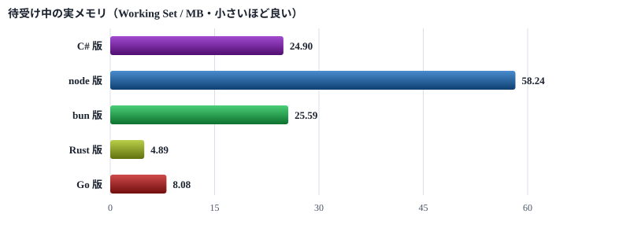
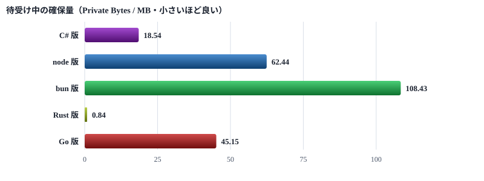
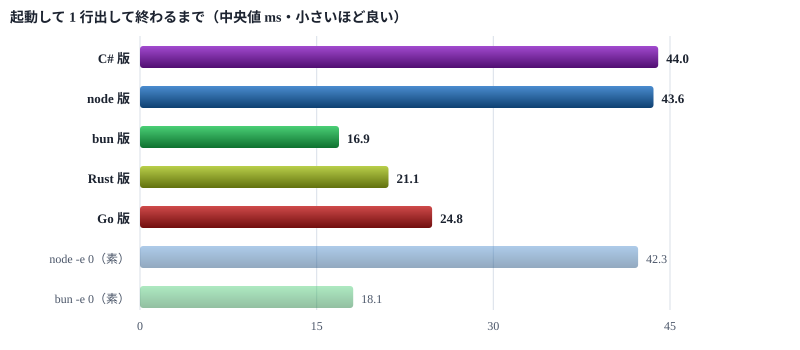
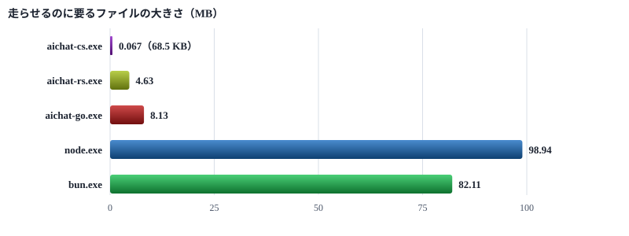
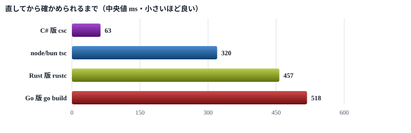

# CLI 5 実装のベンチマーク

待受け中のメモリ・起動の速さ・大きさ・ビルドの時間を、C# ・ node ・ bun ・ Rust ・ Go で並べて測った

> 📅 作成: 2026-09-12 / 更新: 2026-09-12

[README へ戻る](../../README.md)

待受け（`aichat wait`）は 1 プロジェクトにつき 1 本、12 時間張りっぱなしになる。<strong>常駐するものなので、待受け中のメモリがいちばん効く。</strong>そこを軸に、起動の速さ・ソースと実行ファイルの大きさ・ビルドにかかる時間まで並べて測った。

測った時点で持っていたのは **C# 版**（`aichat-cs.exe`）と **node 版**（`src/client/chat.mjs`）の 2 本で、node 版は **bun** でも動く。ここに**比較の下限を知るためだけの最小実装**として **Rust 版**・**Go 版**を足した。後の 2 本は待受けしか持たず、検証も表示もしない。

> [!IMPORTANT]
> <strong>測ったあとで前提が変わった。Mac ・ Linux にも展開すると決めたため、C# は土俵を降りる。</strong>PowerShell で書いた道具も同じである。<br> <strong>CLI は TypeScript（node ・ bun）と Rust の 2 系統で進める。</strong>この資料の数字はそのまま使えるが、**読む順番が変わる**。C# が最小だった項目は、比べる相手がいなくなったという意味になる。

サーバー側は別に測った。[サーバーのベンチマーク](r260912-02-サーバーのベンチマーク.md)にある。

## 1. 分かったこと

> [!IMPORTANT]
> <strong>待受け中の実メモリは Rust 版が 4.89 MB で、node 版の 1/12 だった。</strong>C# 24.90 MB ・ bun 25.59 MB ・ node 58.24 MB とは桁が違う。<br> ただし Rust 版・Go 版は**待受けしか持たない 100 行あまりの最小実装**で、製品と同じ仕事はしていない。**そのまま置き換えられる数字ではない。**

> [!NOTE]
> <strong>Mac ・ Linux へ展開すると決めたので、残る選択肢は TypeScript（node ・ bun）と Rust になる。</strong>その 2 系統で読むと、待受け中の実メモリは **bun 25.59 MB 対 Rust 4.89 MB**。**差は 20.7 MB/本**である。

### 5 実装を 1 枚に

| 実装 | 実メモリ<br>(MB) | 確保量<br>(MB) | 起動 中央値<br>(ms) | ソース<br>(行) | 実行ファイル | ビルド<br>(ms) | 持っている機能 |
|---|---:|---:|---:|---:|---:|---:|---|
| C# 版 | 24.90 | 18.54 | 44.0 | 2,985 | 68.5 KB | 63 | 全部 |
| node 版 | 58.24 | 62.44 | 43.6 | 2,061 | — | — | 全部 |
| bun 版 | 25.59 | 108.43 | 16.9 | 2,061 | — | — | 全部（node 版と同じソース） |
| Rust 版 | 4.89 | 0.84 | 21.1 | 111 | 4.63 MB | 457 | 待受けだけ |
| Go 版 | 8.08 | 45.15 | 24.8 | 124 | 8.13 MB | 518 | 待受けだけ |

### 読み取れること

#### 常駐のコストは Rust が圧倒的に低い

実メモリ（Working Set）で **Rust 4.89 MB ・ Go 8.08 MB ・ C# 24.90 MB ・ bun 25.59 MB ・ node 58.24 MB**。<strong>確保量（Private Bytes）ではさらに差が開き、Rust は 0.84 MB しか確保していない。</strong>bun の 108.43 MB とは 129 倍になる。

#### bun は「軽い」とは言い切れない

> [!CAUTION]
> <strong>実メモリと確保量は別物である。</strong>bun は実メモリ 25.59 MB で C# 版と並ぶが、**確保量は 108.43 MB で 5 実装のうち最大**だった。<br> 実メモリだけを見て「bun は node の半分」と判断すると、<strong>空きメモリが減ったときの挙動を読み違える。</strong>Claude Code が背面のコマンドを刈るのは、この空きが減ったときである。

#### 起動は bun が最速で、Rust より速い

中央値で **bun 16.9 ms < Rust 21.1 ms < Go 24.8 ms < node 43.6 ms ≒ C# 44.0 ms**。ネイティブの実行ファイルが bun に負けるのは意外だが、<strong>この領域ではプロセスを 1 つ作る手間そのものが大きい。</strong>詳しくは [起動の速さ](#3-起動の速さ) に書いた。

#### 機能の量が違うことを忘れない

Rust 版・Go 版は待受けの 1 コマンドしか持たない。製品の 2 本は `say` ・ `who` ・ `waiters` ・ `recent` ・ `restart` などを備え、引数の検証・JST の整形・カーソルの保存まで面倒を見ている。**行数で 2,985 行 ・ 2,061 行 に対して 111 行 ・ 124 行 である。**

置き換えを考えるなら、**常駐する `wait` だけを別の実行ファイルに切り出す**形になる。この資料はその判断材料までで、実装の計画はまだ無い。

#### node で動かすと、往復ごとに 15 ms 乗る

この資料は**起動だけを測っていて、API を叩く時間は測っていない**。サーバーを測ったときに分かったことを 1 つ書いておく。

> [!CAUTION]
> <strong>node の `fetch` は Windows で 1 往復ごとに 15 ms ほど待たされる。</strong>同じ node の `http.request` は 0.18 ms で、85 倍の開きがある。<br> `src/client/chat.mjs` は `fetch` を使っているので、**`say` ・ `who` ・ `recent` はこれを踏む**。bun で動かすと乗らない。<br> 待受け（`wait`）には効かない。1 往復が 240 秒なので埋もれる。課題 [i260912-02](../40_issues/issues.html#i260912-02) に残した。

つまり **node 版の `say` は、起動 43.6 ms に 15 ms を足した値**になる。bun 版なら 16.9 ms のままである。**起動の表だけを見て node と bun の差を 27 ms と読むと、実際より小さく見積もることになる。**

## 2. 待受け中のメモリ

いちばん知りたかったところ。**待受けを立ち上げて 10 秒待ち、2 秒おきに 5 回測る。それを 3 回繰り返した平均**である。子プロセスが居れば合算する（bun は子を作らないため、どの実装も 1 プロセスだった）。

### 実メモリ（Working Set）



図 1: 待受け中の実メモリ。3 回 × 5 サンプルの平均（MB）

### 確保量（Private Bytes）



図 2: 待受け中の確保量。bun がいちばん大きい（MB）

### 数値

| 実装 | 実メモリ 平均 | 実メモリ 幅 | 確保量 平均 | 確保量 幅 | プロセス数 |
|---|---:|---:|---:|---:|---:|
| C# 版 | 24.90 | 24.88 〜 24.92 | 18.54 | 18.50 〜 18.58 | 1 |
| node 版 | 58.24 | 58.21 〜 58.31 | 62.44 | 61.74 〜 62.86 | 1 |
| bun 版 | 25.59 | 25.56 〜 25.63 | 108.43 | 100.78 〜 112.29 | 1 |
| Rust 版 | 4.89 | 4.88 〜 4.90 | 0.84 | 0.82 〜 0.86 | 1 |
| Go 版 | 8.08 | 7.95 〜 8.27 | 45.15 | 44.98 〜 45.42 | 1 |

単位は MB。<strong>幅は 3 回 × 5 サンプル、計 15 点の最小と最大。</strong>どの実装もぶれが小さく、待受けはずっと同じ量を掴んだまま動く。

### 実メモリと確保量の違い

| 指標 | 何を表すか | 足りなくなると |
|---|---|---|
| 実メモリ<br>(Working Set) | いま物理メモリの上に載っている量 | ページアウトされて減る。数字は小さくなるが動きは遅くなる |
| 確保量<br>(Private Bytes) | そのプロセスが OS に確保させた量（載っていない分も含む） | 減らない。ページングファイルを食い続ける |

ランタイムを持つ 3 実装（node ・ bun ・ Go）は、<strong>使う予定の領域をまとめて確保してから、必要になった分だけ物理メモリに載せる。</strong>だから確保量が実メモリを上回る。Rust 版は逆で、確保量 0.84 MB に対して実メモリ 4.89 MB — **この差は実行ファイルそのものと、OS が貸している共有ライブラリの分**である。

### 何本張れるか

待受けはプロジェクトにつき 1 本。同時に 5 本張ったときの実メモリを単純に足すと、こうなる。

| 実装 | 1 本 | 3 本 | 5 本 | 10 本 |
|---|---:|---:|---:|---:|
| node 版 | 58 MB | 175 MB | 291 MB | 582 MB |
| bun 版 | 26 MB | 77 MB | 128 MB | 256 MB |
| C# 版 | 25 MB | 75 MB | 125 MB | 249 MB |
| Go 版 | 8 MB | 24 MB | 40 MB | 81 MB |
| Rust 版 | 5 MB | 15 MB | 24 MB | 49 MB |

> [!TIP]
> <strong>共有ライブラリの分は本数だけ増えるわけではない。</strong>同じ実行ファイルを 5 本走らせても、コードの領域は OS が 1 つを貸し回す。上の表は上限の見積もりであり、**実際にはこれより少なく済む。**

## 3. 起動の速さ

`--help` を渡して、**起動して 1 行出して終わるまで**を測った。ウォームアップ 3 回のあと 20 回。実装の並び順による差を見るため、順番を変えて 2 巡している。



図 3: 起動にかかる時間の中央値。下 2 本（淡い色）はランタイムを素で起動しただけの参考値

| 実装 | 最短 | 中央値 | 平均 | 最長 | 1 巡目 中央値 | 2 巡目 中央値 |
|---|---:|---:|---:|---:|---:|---:|
| bun 版 | 12.1 | 16.9 | 17.4 | 21.8 | 16.9 | 17.9 |
| Rust 版 | 19.8 | 21.1 | 21.8 | 28.1 | 21.1 | 21.9 |
| Go 版 | 23.0 | 24.8 | 25.1 | 29.9 | 24.8 | 25.0 |
| node 版 | 38.4 | 43.6 | 44.2 | 49.4 | 43.6 | 44.5 |
| C# 版 | 38.7 | 44.0 | 44.2 | 49.8 | 44.0 | 44.2 |
| node -e 0（素） | 38.9 | 42.3 | 43.2 | 49.7 | 42.3 | 42.7 |
| bun -e 0（素） | 15.4 | 18.1 | 19.6 | 24.4 | 20.6 | 18.1 |

単位は ms。**1 巡目と 2 巡目の差はどれも 1 ms 前後で、順番による偏りは無かった。**

### 読み取れること

#### アプリのコードはほとんど乗っていない

<strong>node 版 43.6 ms に対して、素の `node -e 0` が 42.3 ms。</strong>差は 1.3 ms しかない。`chat.mjs` と 3 つのモジュール、計 2,061 行を読んで構文解析する分がこれである。**起動時間の 97% は Node そのものの立ち上がり**で、アプリを削っても速くならない。

bun も同じで、bun 版 16.9 ms に対して素の bun が 18.1 ms。**誤差の中に埋もれている。**

#### C# 版が node と並ぶのは意外だった

ネイティブの実行ファイルなら速いと思っていたが、**44.0 ms で node 版と変わらない。**.NET は実行ファイル自体が 68.5 KB でも、走らせるには共有のランタイムを読み込んで JIT を立ち上げる必要がある。**そこが node の立ち上がりと同じくらいかかっている。**

#### Rust・Go が bun に負ける

> [!NOTE]
> Rust 21.1 ms ・ Go 24.8 ms は、<strong>どちらも「何もしないに等しい 100 行あまり」の起動である。</strong>それでも bun の 16.9 ms に届かない。<br> この領域では**プロセスを 1 つ作って、実行ファイルを読み込んで、終了コードを返すまでの OS の手間**が支配的になる。実行ファイルが 4.63 MB ・ 8.13 MB と大きいことも効いている。

#### ただし待受けでは効かない

待受けは 12 時間に 1 回しか起動しない。<strong>起動が 20 ms 速いことには、ほとんど意味が無い。</strong>効くのは `say` ・ `who` のように何度も叩くコマンドのほうで、そこでは bun が有利になる。

## 4. ソースと実行ファイルの大きさ

> [!IMPORTANT]
> <strong>Rust 版・Go 版の行数は参考値である。</strong>製品の 2 本と同じ仕事をしていない。待受けの 1 コマンドだけを、検証も表示も省いて書いたものである。

### ソースの行数

| 実装 | 行数 | 内訳 |
|---|---:|---|
| C# 版 | 2,985 | `Commands.cs` 798 / `Waiters.cs` 509 / `Program.cs` 368 / `Args.cs` 303 / `Json.cs` 256 / `Client.cs` 227 / `Definition.cs` 216 / `SinceParse.cs` 196 / `WaitLog.cs` 66 / `JstTime.cs` 46 |
| node 版<br>bun 版 | 2,061 | `chat.mjs` 1,530 / `options.mjs` 230 / `since-parse.mjs` 186 / `waiters-pick.mjs` 115 |
| Rust 版 | 111 | `tools/40_test/wait-rs/main.rs`（参考） |
| Go 版 | 124 | `tools/40_test/wait-go/main.go`（参考） |

C# 版が node 版より 45% 多い。<strong>JSON の読み書き（`Json.cs` 256 行）が標準で用意されておらず、自前で持っているのが効いている。</strong>node 側はこれが `JSON.parse` の 1 行で済む。

### 実行ファイルの大きさ



図 4: 走らせるのに要るファイル。C# 版は棒が見えないほど小さいが、別に .NET ランタイムが要る

| ファイル | バイト | 読みやすく | これだけで動くか |
|---|---:|---:|---|
| `aichat-cs.exe` | 70,144 | 68.5 KB | いいえ。.NET ランタイムが要る |
| `aichat-rs.exe` | 4,851,614 | 4.63 MB | はい |
| `aichat-go.exe` | 8,526,336 | 8.13 MB | はい |
| `node.exe` | 103,747,400 | 98.94 MB | スクリプトと合わせて動く |
| `bun.exe` | 86,096,984 | 82.11 MB | スクリプトと合わせて動く |

> [!TIP]
> **「小さい」の意味が 3 通りある。**<br> **配る量**なら C# 版の 68.5 KB が最小。ただし受け取る側に .NET が要る。<br> **1 ファイルで完結する量**なら Rust 版の 4.63 MB が最小。何も前提を置かずに渡せる。<br> **すでに入っているものを使う**なら node ・ bun は 0 バイト。このマシンにはどちらも入っている。

Rust 版が 4.63 MB もあるのは、**外部クレートを 1 つも使っていないのに標準ライブラリを丸ごと抱き込むため**である。Go 版の 8.13 MB も同じで、`net/http` を入れた分だけ大きい。

## 5. ビルドと文法チェックの時間

コードを直してから確かめられるまでの待ち時間である。**node 版・bun 版はビルドが無いので 0 ms**だが、代わりに **TypeScript の検査を掛ける**とどうなるかを測った。



図 5: ビルド（C# ・ Rust ・ Go）と文法チェック（node/bun）にかかる時間の中央値

| 実装 | 使ったもの | 1 回目 | 2 回目 | 3 回目 | 中央値 | 対象 |
|---|---|---:|---:|---:|---:|---|
| C# 版 | `csc` | 85 | 63 | 58 | 63 | 2,985 行 |
| node 版<br>bun 版 | `tsc --noEmit` | 319 | 320 | 331 | 320 | 2,061 行 |
| Rust 版 | `rustc -O` | 457 | 463 | 456 | 457 | 111 行 |
| Go 版 | `go build` | 1,362 | 518 | 435 | 518 | 124 行 |

単位は ms。<strong>Go の 1 回目 1,362 ms はビルドキャッシュが空だったため。</strong>2 回目以降は標準ライブラリの再コンパイルが要らなくなり、435 〜 518 ms に落ち着く。

Rust は 111 行に対して 457 ms かかっている。<strong>キャッシュの効き方は Go と違い、1 回目から 3 回目までほぼ変わらない。</strong>単一ファイルを `rustc` に直接渡しているので、毎回まるごとやり直している。

### TypeScript の文法チェック

まだ TypeScript 化していないので、**`allowJs` ＋ `checkJs` で `.mjs` のまま型検査に掛けた**。設定は `tmp/tsc-check/tsconfig.json` に置いた一時のもの。

```json
{
	"compilerOptions": {
		"target": "ES2022",
		"module": "ESNext",
		"moduleResolution": "bundler",
		"allowJs": true,
		"checkJs": true,
		"noEmit": true,
		"strict": false,
		"skipLibCheck": true,
		"types": ["node"]
	},
	"include": ["../../src/client/*.mjs"]
}
```

> [!IMPORTANT]
> **320 ms で 5 件のエラーが出た。**`strict` を切った緩い設定でこれである。**文法の誤りではなく、型の食い違いを 5 件見つけた。**

| 場所 | 件数 | 何を言っているか |
|---|---:|---|
| `chat.mjs:1047` | 2 | 算術演算の左右が数値だと保証できない。文字列が入りうる値をそのまま引き算している |
| `chat.mjs:1147`<br>`chat.mjs:1148`<br>`chat.mjs:1149` | 3 | `Property 'rooms' / 'pid' does not exist on type 'object'`。`JSON.parse` の戻りを `object` のまま辿っている |

どちらも**実際に落ちる場所ではない**（サーバーが返す形は決まっている）。それでも、**320 ms で 5 件の「保証できていない箇所」が機械的に出てくる**のは、2,061 行を目で読むより確実である。

> [!CAUTION]
> <strong>検査には `@types/node` が要る。</strong>入れずに走らせると `process` ・ `fs` など Node の API がすべてエラーになり、**57 件の無意味なエラーに本物の 5 件が埋もれる。**<br> 今回は `tmp/tsc-check/` に一時で入れて測った。<strong>常用するなら、プロジェクト側に開発用の依存として置く判断が要る。</strong>この資料はその判断材料までで、まだ入れていない。

## 6. 測り方

### 環境

| 項目 | 版 |
|---|---|
| OS | Microsoft Windows NT 10.0.26200.0 |
| Node.js | v26.8.1 |
| bun | 1.4.2 |
| Rust | 1.96.1 |
| Go | 1.26.4 |
| TypeScript | 7.0.2 |
| 測った日時 | 2026-09-12 21:56 |

### 使ったもの

| 置き場 | 中身 |
|---|---|
| `tools/40_test/benchmark-cli.ps1` | 本体。メモリと起動を測って `tmp/benchmark-cli.json` に書き出す |
| `tools/40_test/benchmark-cli.cmd` | ダブルクリック用のランチャー |
| `tools/40_test/wait-rs/main.rs` | Rust 版の最小の待受け（111 行） |
| `tools/40_test/wait-go/main.go` | Go 版の最小の待受け（124 行） |

### 測る手順

| 何を | どう測ったか |
|---|---|
| メモリ | `--wait-sec 600` で待受けを立て、10 秒待ってから 2 秒おきに 5 回。これを 3 回繰り返して平均を取る。子プロセスも合算する |
| 起動 | `--help` を渡し、ウォームアップ 3 回のあと 20 回。並び順を変えて 2 巡 |
| ソース行数 | `wc -l`。空行とコメントを含む |
| 実行ファイル | バイト数をそのまま。MB は 1024<sup>2</sup> で割った値 |
| ビルド | 出力を消してから 3 回。Go だけキャッシュが効くので 1 回目が突出する |
| 文法チェック | `tmp/tsc-check/` に `typescript` と `@types/node` を入れ、`tsc --noEmit` を 3 回 |

### 踏んだ落とし穴

#### 待受けが起動直後に落ちる

初めて繋ぐ相手には**案内だけ出して終わる仕様**になっている（[課題](../40_issues/issues.html)の i260909-01）。そのままだとメモリを測る前に消える。

<strong>先に `--wait-sec 1` で 1 回走らせてカーソルを立ててから、本番の `--wait-sec 600` を立てる。</strong>2 回目以降は普通にぶら下がる。

#### CLI の案内が例外になる

繋ぎ先の案内を標準エラーに出すため、`$ErrorActionPreference = 'Stop'` のもとでは `NativeCommandError` になって止まる。

```powershell
function Invoke-Quiet {
	param([string] $File, [string[]] $Arguments)
	$prev = $ErrorActionPreference
	$ErrorActionPreference = 'Continue'
	try { & $File @Arguments *> $sink } finally { $ErrorActionPreference = $prev }
}
```

<strong>局所的に `Continue` へ落として、抜けるときに戻す。</strong>スクリプト全体を `Continue` にすると、本物のエラーまで見逃す。

#### リダイレクト先のファイルが競合する

待受けと起動測定で同じ捨て場を共有していたため、**別のプロセスで使用されている**で落ちた。**毎回 `[guid]::NewGuid()` で別名にし、プロセスを止めてから 500 ms 待って消す。**

#### Bash から呼ぶと出力が化ける

> [!NOTE]
> PowerShell 5.1 の標準出力は CP932 として扱われる。Bash 経由で呼ぶと日本語が崩れるので、**先頭で `[Console]::OutputEncoding = [Text.Encoding]::UTF8` を立てる。**<br> `aichat-cs.exe` だけは化けない。`Program.cs` が自分で `Console.OutputEncoding = Encoding.UTF8` を立てているためである。

### この測り方の限界

- <strong>Rust 版・Go 版は製品と同じ仕事をしていない。</strong>引数の検証・JST の整形・カーソルの保存・エラーの案内を持たない。機能を足せばメモリも大きさも増える
- **1 台のマシンでの値である。**.NET ランタイムが入っていない環境では C# 版の起動が変わる
- <strong>ビルド時間はキャッシュの状態に強く依存する。</strong>Go の 1 回目と 3 回目で 3 倍以上ちがった
- **tsc の 5 件は、緩い設定での値である。**`strict` を入れれば桁が変わる

[README へ戻る](../../README.md)
