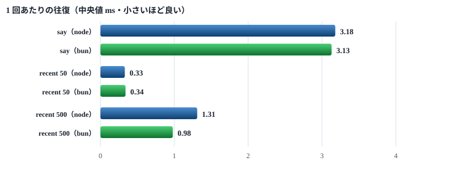
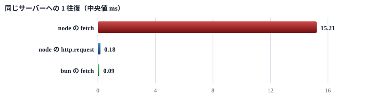

# サーバーのベンチマーク

node と bun で、待受けの相手としてのメモリ・say ・ recent ・ 配信の遅れを測った

> 📅 作成: 2026-09-12 / 更新: 2026-09-12

[README へ戻る](../../README.md)

サーバーは Windows サービスとして常駐し、待受けの相手をしている。<strong>常駐するものなのでメモリがいちばん効く。</strong>そこに `say` ・ `recent` の往復と、発言を待受けへ配る遅れを足して測った。

測ったのは **node と bun の 2 つだけ**である。サーバーは TypeScript（node ・ bun）で進めると決めたため、他の処理系は土俵に載せていない。

## 1. 分かったこと

> [!IMPORTANT]
> <strong>差が出たのはメモリと起動だけで、そこは bun が勝つ。</strong>待受けが 10 本ぶら下がった状態で node 56.51 MB ・ bun 37.47 MB。<br> <strong>`say` ・ `recent` ・ 配信の遅れには差が無い。</strong>どれも SQLite と配信の仕組みが決めていて、処理系を替えても動かない。

| 項目 | node | bun | 読み方 |
|---|---:|---:|---|
| 起動（待ち受け開始まで） | 181.3 ms | 113.8 ms | bun が 68 ms 速い。常駐するので効かない |
| メモリ 待受け 0 本 | 54.43 MB | 31.54 MB | **bun が 22.9 MB 軽い** |
| メモリ 待受け 10 本 | 56.51 MB | 37.47 MB | bun が 19.0 MB 軽い |
| say | 3.18 ms | 3.13 ms | 差なし |
| recent 50 件 | 0.33 ms | 0.34 ms | 差なし |
| recent 500 件 | 1.31 ms | 0.98 ms | わずかに bun |
| 配信 10 本へ | 27.95 ms | 26.35 ms | 差なし |

### 待受けの相手をするコストは、ほとんど無かった

測る前は「待受けを何本も抱えると重くなる」と思っていたが、**10 本ぶら下げても node で 2.08 MB、bun で 5.93 MB しか増えなかった**。1 本あたり 0.21 MB ・ 0.59 MB である。

**常駐コストを決めているのは、ぶら下がっている本数ではなく処理系そのもの**だった。そこで 22.9 MB の差が付いている。

> [!TIP]
> <strong>1 本あたりの伸びは bun のほうが 2.8 倍きつい。</strong>それでも出発点が 22.9 MB 低いので、追いつかれるのは **59 本ぶら下がったとき**である。<br> 待受けは 1 プロジェクトにつき 1 本。**現実に並ぶのは数本なので、この交差点には届かない。**

### 速さを決めているのは処理系ではない

| 操作 | かかる時間 | 何が決めているか |
|---|---:|---|
| `say` | 3.1 ms | SQLite への書き込み。処理系を替えても動かない |
| `recent` 50 件 | 0.33 ms | 読むだけ。十分速い |
| `recent` 500 件 | 1.1 ms | 件数に比例。10 倍にして 3 倍 |
| 配信 | 2.2 ms/本 | 待受けを 1 本ずつ起こす手間 |

`say` の 3.1 ms は**読み取りの 10 倍**かかっている。WAL に同期で書いているためで、ここを速くしたいなら処理系ではなく書き方を変えることになる。**ただし人が待つ時間としては十分短い。**

> [!CAUTION]
> <strong>測ったのは実メモリ（RSS）だけである。</strong>確保量（Private Bytes）は測っていない。OS ごとに測り方が分かれるため、`process.memoryUsage()` で揃えた結果として落ちた。<br> CLI を測ったときは <strong>bun の確保量が 5 実装のうち最大（108 MB）</strong>だった。サーバーでも同じ傾向なら、この資料の数字だけで決めるのは早い。

## 2. 待受けの相手としてのメモリ

待受けを 0 ・ 1 ・ 5 ・ 10 本ぶら下げ、それぞれで落ち着くのを待ってから 3 秒ぶんを平均した。


図 1: 待受けを増やしてもほとんど伸びない。差は出発点に付いている

| 待受け | node | bun | 差 |
|---|---:|---:|---:|
| 0 本 | 54.43 MB | 31.54 MB | 22.89 MB |
| 1 本 | 54.75 MB | 34.62 MB | 20.13 MB |
| 5 本 | 55.39 MB | 36.14 MB | 19.25 MB |
| 10 本 | 56.51 MB | 37.47 MB | 19.04 MB |
| **1 本あたりの伸び** | 0.21 MB | 0.59 MB | — |

### なぜ伸びないか

待受けは `/api/poll` にぶら下がったまま何もしない。サーバー側が抱えるのは **TCP の接続 1 本と、いつ起こすかを覚えておく分だけ**である。発言が来るまで処理は動かない。

1 本あたり node 0.21 MB ・ bun 0.59 MB。**bun のほうが 1 本を重く持つ**が、出発点の差が大きいので順位は変わらない。

### どこで追いつかれるか

この伸び方がそのまま続くとして解くと、**59 本**で交差する。

```text
node   54.43 + 0.21 × n
bun    31.54 + 0.59 × n
                       → n ≒ 59
```

待受けは 1 プロジェクトにつき 1 本と決めている。**59 本が並ぶことは無い。**

## 3. say と recent

人が待つのはここである。`say` は 200 回、`recent`（`/api/history`）は件数を変えて 200 回ずつ測った。


図 2: node（青）と bun（緑）で差が出ていない。決めているのは DB のほう

| 操作 | 処理系 | 中央値 | p95 | 最小 | 最大 |
|---|---|---:|---:|---:|---:|
| `say` | node | 3.18 | 4.57 | 2.26 | 9.46 |
|  | bun | 3.13 | 4.55 | 2.29 | 6.08 |
| `recent` 50 件 | node | 0.33 | 0.54 | 0.29 | 1.05 |
|  | bun | 0.34 | 0.46 | 0.29 | 1.88 |
| `recent` 500 件 | node | 1.31 | 2.51 | 1.18 | 3.53 |
|  | bun | 0.98 | 1.95 | 0.82 | 3.93 |

単位は ms。

### 書くのは読むより 10 倍かかる

`say` 3.1 ms に対して `recent` 50 件が 0.33 ms。**差は SQLite に同期で書いているぶん**である。読むほうはメモリの上で済むことが多い。

件数を 50 から 500 へ 10 倍にしても、かかる時間は 3 倍にしかならない。**問い合わせ自体の手間が大きく、件数はその上に乗るだけ**だからである。

### 待受けを抱えたままでも遅くならない

| 状況 | node | bun |
|---|---:|---:|
| 誰もぶら下がっていない | 3.18 ms | 3.13 ms |
| 待受けが 10 本ぶら下がっている | 3.02 ms | 3.02 ms |

別のルームへ打って、起こす処理が混ざらないようにして測った。**抱えているだけでは何も起きない。**

## 4. 配信の遅れ

`say` を打ってから、ぶら下がっている待受けが**全員返るまで**を測った。人から見ると「送った」から「相手に出た」までである。



図 3: 本数にきれいに比例する。node と bun はほぼ重なる

| 待受け | node | bun | 1 本あたり |
|---|---:|---:|---:|
| 1 本 | 5.55 ms | 5.83 ms | — |
| 5 本 | 16.12 ms | 16.27 ms | 2.6 ms |
| 10 本 | 27.95 ms | 26.35 ms | 2.2 ms |

### 読み取れること

<strong>本数に比例する。</strong>1 本増えるごとに 2.2 〜 2.6 ms。待受けを 1 本ずつ起こし、その相手ごとに返すものを作っているためである。

最初の 1 本に 5.6 ms かかるのは、**`say` 自体の 3.1 ms が含まれている**から。書き終えてから起こしにいく。

> [!NOTE]
> <strong>10 本で 28 ms なら、人には分からない。</strong>並ぶのはせいぜい数本なので、いまの作りで困る場面は無い。<br> 比例するということは、**本数が 2 桁になれば効いてくる**という意味でもある。100 本なら 220 ms。そこまで増やすなら配り方を変える話になる。

## 5. 測り方

| 項目 | 版 |
|---|---|
| OS | Microsoft Windows NT 10.0.26200.0 |
| Node.js | v26.8.1 |
| bun | 1.4.2 |
| 測った日 | 2026-09-12 |

### 使ったもの

| 置き場 | 中身 |
|---|---|
| `tools/40_test/benchmark-server.mjs` | 本体。結果を `tmp/benchmark-server.json` に書く |
| `tools/40_test/server-probe.mjs` | サーバーを同じプロセスで立て、メモリを報告する |

### メモリは、外からではなく中から測る

別のプロセスのメモリを測る手立ては OS ごとに違う。Windows は `tasklist` ・ WMI、Mac ・ Linux は `ps` になる。**Mac ・ Linux にも展開するので、測り方が OS で分かれる形は持ちたくない。**

そこで <strong>サーバーを子プロセスの中で `import` し、そのプロセス自身に `process.memoryUsage()` を呼ばせた。</strong>node でも bun でも、どの OS でも同じ 1 本のコードで済む。

```javascript
// server-probe.mjs
await import(pathToFileURL(join(root, 'src', 'server', 'main.mjs')).href);
process.stdout.write('__READY__\n');
setInterval(() => {
	const m = process.memoryUsage();
	process.stdout.write(`__MEM__ ${m.rss} ${m.heapUsed} ${m.heapTotal} ${m.external}\n`);
}, 250);
```

親は標準出力の印つきの行だけを拾う。**サーバー自身のログも同じ出力に混ざる**ので、印で選り分けている。

### 本番に触らない作りにする

| 守り | やり方 |
|---|---|
| 置き場 | `tmp/bench-server/<処理系>/_data` を渡す。既定でなければテスト用として立つ |
| ポート | OS に空きを割り当てさせる。**番号をソースに書かない**ので、本番へ飛ぶ打ち間違いが起きない |
| 立った後 | probe が本番の置き場だったら、測る前に `exit 3` で止める |
| 終わったら | 置き場ごと捨てる |

> [!CAUTION]
> <strong>ベンチマークは `say` を 800 回以上打つ。</strong>置き場を渡し損ねて本番の DB を掴むと、そのまま残る。<br> だから probe 側にも確かめを置いた。**渡す側の注意に頼らず、立った先で止める。**

### 測る手順

| 何を | どう測ったか |
|---|---|
| 起動 | プロセスを作ってから `__READY__` が出るまで |
| メモリ | 本数ごとに 2 秒落ち着かせ、3 秒ぶん（250 ms 間隔）を平均 |
| `say` ・ `recent` | 捨てる 20 回のあと 200 回。`recent` は先に 600 件積んでから |
| 配信 | 張り直しては 1 回打つ、を 10 回 |

### この測定の限界

- <strong>実メモリ（RSS）しか測っていない。</strong>確保量は OS ごとに測り方が分かれるため落とした
- <strong>1 台の Windows で測った。</strong>Mac ・ Linux では変わりうる
- <strong>DB は空から 600 件まで。</strong>本番の量では `recent` の数字が変わる
- <strong>待受けは同じマシンから張った。</strong>すべてループバックで、実際の経路とは違う

## 6. 測り直しになった話

> [!IMPORTANT]
> <strong>最初の測定は捨てた。</strong>サーバーではなく、測っている側を測っていた。<br> `say` も `recent` も、件数を 10 倍にしても**一律 15 ms**になった。そこで気づいた。

### 気づいた形

| 測ったもの | node の値 | bun の値 |
|---|---:|---:|
| `say` | 15.46 ms | 15.37 ms |
| `recent` 50 件 | 13.64 ms | 15.53 ms |
| `recent` 500 件 | 15.66 ms | 15.10 ms |

**書くのも読むのも、50 件も 500 件も同じ値になる**ことはない。**どれかが全部を律速している。**

### 切り分け

何もしない HTTP サーバーを立てて、同じやり方で測った。



図 4: 遅いのは node の fetch だけ。同じ node でも http.request は 85 倍速い

<strong>node の `fetch` だけが遅かった。</strong>最小は 0.36 ms まで下がるので、返せないのではなく待たされている。**Windows の既定のタイマー解像度 15.6 ms と一致する。**

### 直した形

ベンチマークの側を `node:http` の `http.request`（keepAlive つき）に替えた。**node で走らせても bun で走らせても同じ数字が出る**ようになり、そこで初めて処理系の差が見えた。

| 測り方 | node サーバーの say | bun サーバーの say | 差が見えるか |
|---|---:|---:|---|
| node の fetch で測る | 15.46 ms | 15.37 ms | 見えない |
| http.request で測る | 3.18 ms | 3.13 ms | 見える（そして差は無かった） |

結論は変わらなかったが、**「差が無い」と「差が見えない」は別のこと**である。前者は測ってから言える。

### 持ち帰り

> [!CAUTION]
> <strong>ローカルの往復を node の `fetch` で測ってはいけない。</strong>15 ms 未満のものはすべて 15 ms に見える。<br> CLI も `src/client/chat.mjs` で `fetch` を使っているので、**node で動かすと 1 往復ごとにこれが乗る**。課題 [i260912-02](../40_issues/issues.html#i260912-02) に残した。

再現の手順は `tests/http-client-latency.test.mjs` に置いた。速さの下限は決めていない。<strong>手段によって結果が変わったときだけ落ち、往復の時間は毎回数字として出る。</strong>課題が直ったかはその数字で見る。

[README へ戻る](../../README.md)
