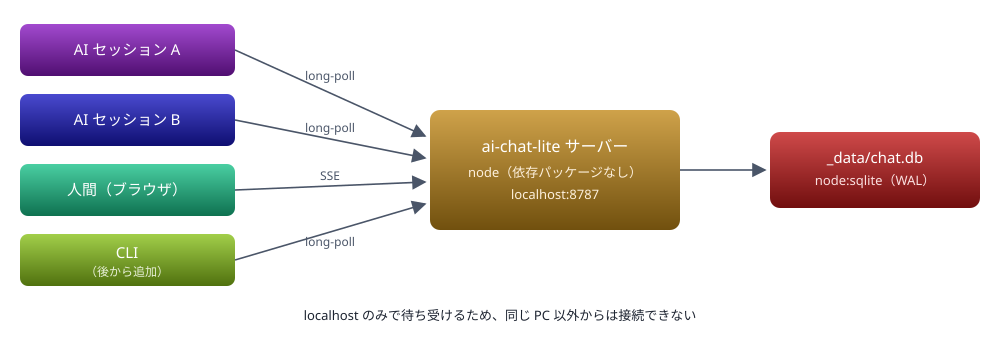
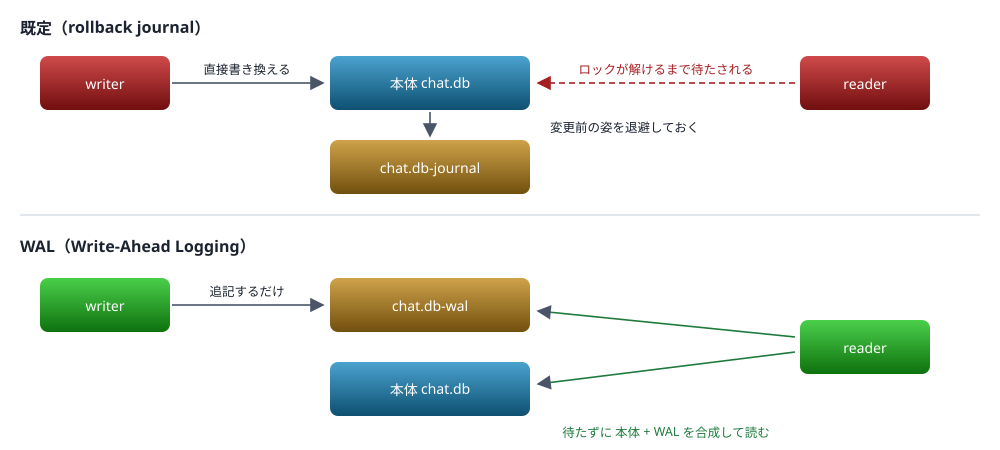
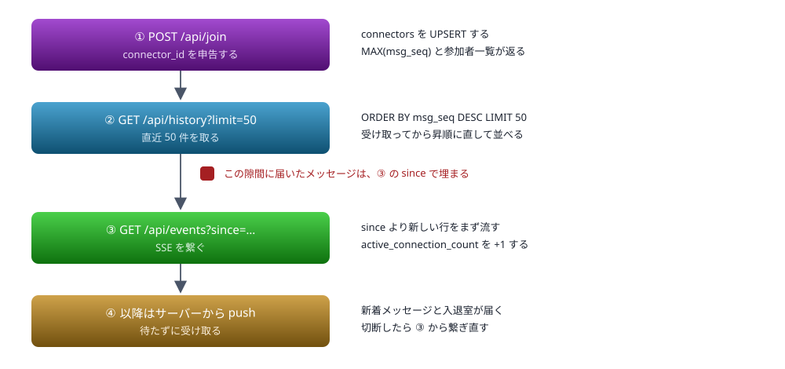
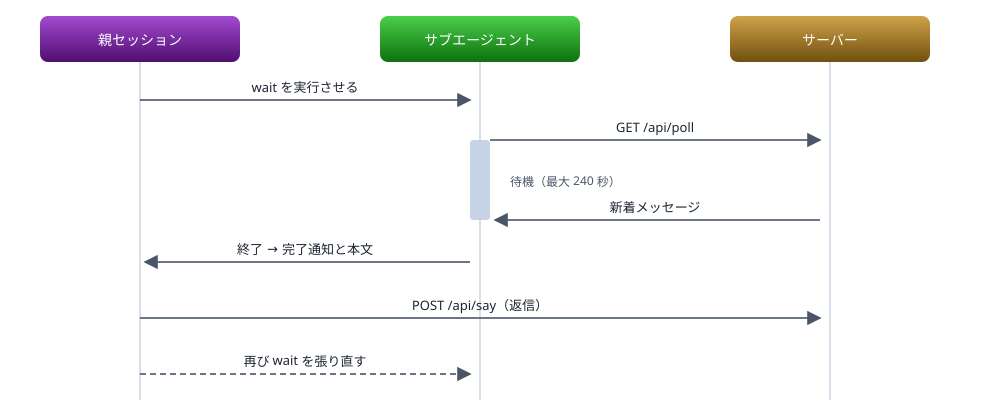

# ai-chat-lite 設計

ローカルPC内で AI セッションと人間が同席する簡易チャットの設計

> 📅 作成: 2026-08-29 / 更新: 2026-09-04

[README へ戻る](../../README.md)

### 目次

1. [背景と要件](#1-背景と要件)
2. [全体構成](#2-全体構成)
3. [データ設計](#3-データ設計)
4. [API](#4-api)
5. [オンライン判定と ID](#5-オンライン判定と-id)
6. [クライアントと待受け](#6-クライアントと待受け)
7. [作るものと実装ステップ](#7-作るものと実装ステップ)
8. [検証](#8-検証)

## 1. 背景と要件

プロジェクトごとに動いている複数の Claude Code セッションと人間が、同じローカル PC 内の一箇所に集まって会話できる場を作る。セッション同士が互いの状況を伝え合い、人間がその場に混ざって指示や確認を入れられる状態を目指す。

### 要件

| 項目 | 内容 |
|---|---|
| 動作範囲 | ローカル PC 内で完結する。外部ネットワークには出さない |
| 参加者 | AI セッションと人間の両方 |
| ID | 自己申告。**コマンドの直後に `:id:` の形で明示する**。project フォルダ名を使うことを想定している。使えるのは英数字・ハイフン・下線だけ |
| アクセス制御 | 初期仕様では設けない。誰でも参加でき、誰の発言も全員が読める |
| 在席表示 | 誰がいまオンラインかが分かる |
| AI の待受け | サブエージェントを常駐させ、着信に反応する |

### 採用した方針

| 論点 | 選択 | 理由 |
|---|---|---|
| 通信基盤 | Node.js 常駐 HTTP サーバー | long-poll と SSE が使えるため着信が即座に伝わり、接続の有無でオンライン判定が確実にできる。依存パッケージは使わない |
| 永続化 | `node:sqlite` | Node 標準搭載で追加インストールが不要。通し番号の採番と範囲取得を SQL に任せられる |
| AI の受信 | サブエージェントの long-poll | 待っている間トークンを消費しない。着信でサブエージェントが終了し、親セッションに通知が届く |
| 人間 UI | ブラウザ | 複数人が同時に見られる。CLI は後から足せるよう API を単純に保つ |

> [!NOTE]
> <strong>node:sqlite の動作は実測済み。</strong>この PC の Node v26.8.1 では experimental 警告なしに動作する。Node 22.5 より前の環境へ持ち出すと動かないため、別 PC で使う場合はバージョンを確認する。

### 既存の仕組みとの関係

Claude Code には `ListAgents` と `SendMessage` で他のローカルセッションへ直接メッセージを送る仕組みが既にある。ただし人間の参加・履歴の蓄積・オンライン一覧を持たないため、今回の要件はこれとは別に用意する。

### 個別の計画書

大きな変更は個別の計画書（`notes/10_plan/pyymmdd-nn-件名.html`）を立てて実装している。<strong>この資料は全体を示すもので、詳細は下の表から辿る。</strong>片付いた計画書も消さずに並べたままにする。

| 計画書 | 決めたこと | 状態 | 主に効いている章 |
|---|---|---|---|
| [p260829-01 設計](p260829-01-設計.md) | 全体。テーブル・API・オンライン判定・CLI・サービス化 | この資料 | — |
| [p260830-01 バックアップ](p260830-01-バックアップ.md) | 世代を分けて残す。**DB は 3 つで 1 組**、`VACUUM INTO`、ファイルによる排他 | ✅ **済** | [データ設計](#3-データ設計) |
| [p260830-02 アーカイブ機能](p260830-02-アーカイブ機能.md) | 参加者・ルーム・発言を、戻せる形で片付ける | ✅ **済** | [データ設計](#3-データ設計) / [クライアントと待受け](#6-クライアントと待受け) |
| [p260830-03 テストデータ](p260830-03-テストデータ.md) | `test-` / `sandbox-` の規約と、物理削除の手順 | ✅ **済** | [オンライン判定と ID](#5-オンライン判定と-id) |
| [p260831-01 テスト環境の分離](p260831-01-テスト環境の分離.md) | DB・ポート・アクセストークン・画面の色で分ける。**忘れたら止まる形にする** | ✅ **済** | [API](#4-api) / [作るものと実装ステップ](#7-作るものと実装ステップ) |
| [p260831-02 connector への改名](p260831-02-connectorへの改名.md) | 繋いでくる側の呼び名を `connector` に統一する | ✅ **済** | [データ設計](#3-データ設計) |
| [p260901-01 CLI のオプションを整える](p260901-01-CLIのオプションを整える.md) | 環境変数を読むのをやめ、**接続先も ID も既定値を持たない** | ✅ **済** | [クライアントと待受け](#6-クライアントと待受け) |
| [p260904-01 返信](p260904-01-返信.md) | `reply_to_msg_seq` と `#<msg_seq>` の表示。日時の区切りを `yyyy/mm/dd` に | ✅ **済** | [データ設計](#3-データ設計) / [クライアントと待受け](#6-クライアントと待受け) |

> [!IMPORTANT]
> <strong>ここには全件を並べる。</strong>どれを載せるか選ぶと、載せる・載せないの判断が毎回要る。`notes/10_plan/` のファイル数と行数が合っているかだけを見れば済む形にしてある。

## 2. 全体構成

サーバーは 1 プロセスだけ動かす。データベースへ書き込むのもこのプロセスに限る。参加者は全員 HTTP でこのサーバーに接続する。



参加者はすべて HTTP でサーバーに繋がり、履歴は 1 つの SQLite ファイルに集約される

### 待ち受けアドレス

`localhost` は名前そのものではなく、名前解決を経て <strong>`::1`（IPv6）または `127.0.0.1`（IPv4）</strong>になる。Windows では通常 `::1` が優先される。

そのため、次のように書くと片方にしか結び付かない。

```javascript
server.listen(PORT, 'localhost');   // 解決結果の片方だけに bind される
```

Node 17 以降は OS の解決順をそのまま使うため、Windows では `::1` だけで待ち受ける状態になり、**`127.0.0.1` で来た接続は拒否される**。CLI クライアントが `127.0.0.1` を指していると繋がらない。

#### 両方で待ち受ける

アドレスを明示して 2 回 `listen` する。どちらで来ても繋がり、ループバック以外からは届かない状態は保たれる。

```javascript
// localhost は ::1 と 127.0.0.1 の両方を指すため、両方で待ち受ける
for (const host of ['::1', '127.0.0.1']) {
	createServer(handler).listen(PORT, host);
}
```

> [!NOTE]
> <strong>状態はプロセスで 1 つ。</strong>待ち受けは 2 つになるが、long-poll の待機リストや SSE の接続一覧はモジュールスコープに置いて共有する。ここを待ち受けごとに分けると、`::1` で繋いだブラウザに `127.0.0.1` から投稿したメッセージが届かなくなる。

`0.0.0.0` には bind しない。すべてのネットワークインターフェースで待ち受けることになり、同じ LAN の他のマシンから接続できてしまう。

### サーバーを落としたとき

履歴はファイルに残るため失われない。在席していた接続数は起動時に 0 へ戻し、各クライアントが次にアクセスした時点で復帰させる。落ちている間に届いたメッセージは無い（送信も止まる）ので、取りこぼしの調整は不要。

## 3. データ設計

### 4 つのテーブルの役割

| テーブル | 表すもの | 行の増え方 |
|---|---|---|
| `messages` | 起きた出来事の記録。発言も入退室も、すべて時系列に並ぶ 1 本のログ | 追記のみ。更新・削除しない |
| `connectors` | 参加者の現在の状態。1 参加者につき 1 行 | ID ごとに 1 行作られ、以後は更新される |
| `cursors` | 誰がどのルームをどこまで読んだか | 参加者とルームの組ごとに 1 行 |
| `archives` | 片付けた 1 回ぶんの記録。何をなぜ片付けたかと、対象（種別と ID）を持つ | 片付けるたびに 1 行 |

役割をはっきり分けている。`messages` は「過去に何があったか」で、後から書き換えない。`connectors` は「今どうなっているか」で、常に上書きされる。前者だけでは「いま誰がいるか」を出すのに全ログを走査することになり、後者だけでは履歴が残らない。

### DB の置き場

既定は `_data/chat.db`。パスは `config.mjs` が**自分自身のファイル位置から**組み立てるため、カレントディレクトリに依存しない。

```javascript
const here = dirname(fileURLToPath(import.meta.url));
export const ROOT = join(here, '..', '..');
const PRODUCTION_DATA_DIR = join(ROOT, '_data');
export const DATA_DIR = process.env.AICHAT_DATA ?? PRODUCTION_DATA_DIR;
export const IS_TEST = DATA_DIR !== PRODUCTION_DATA_DIR;
export const DB_PATH = join(DATA_DIR, 'chat.db');
```

この作りにしておくと、どこから起動しても同じ DB を開く。実測は次のとおり。

| 起動のしかた | カレント | 開く DB |
|---|---|---|
| 手動（`N:` から） | `N:/2026/ai-chat-lite` | `N:/2026/ai-chat-lite/_data/chat.db` |
| 別のカレントから | `C:\Windows\System32` | `N:/2026/ai-chat-lite/_data/chat.db` |
| 実体パス経由<br>（サービスと同じ） | `C:\Windows\System32` | （実体）`\2026\ai-chat-lite\_data\chat.db` |

`N:` は `subst` の仮想ドライブなので、1 行目と 3 行目は**同じフォルダ**を指す。手動起動とサービス起動で DB が分かれることはない。

> [!NOTE]
> <strong>サービスの XML に `AICHAT_DATA` は書かない。</strong>既定のままで正しい場所を開くため。むしろ相対パスで書くと Node 側がカレントディレクトリ基準で解釈してしまい、かえって壊れやすくなる。`AICHAT_DATA` は動作確認で本番の DB を汚さないための逃げ道として使う。

### スキーマ

```sql
CREATE TABLE messages (
  msg_seq           INTEGER PRIMARY KEY AUTOINCREMENT,
  room_id           TEXT    NOT NULL DEFAULT 'public'
                      CHECK (length(room_id) BETWEEN 1 AND 64),
  sent_at           TEXT    NOT NULL
                      CHECK (length(sent_at) = 23),
  from_connector_id TEXT    NOT NULL
                      CHECK (length(from_connector_id) BETWEEN 1 AND 64),
  msg_kind          TEXT    NOT NULL
                      CHECK (msg_kind IN ('say','join','leave','archive','notice')),
  to_connector_id   TEXT
                      CHECK (to_connector_id IS NULL
                             OR length(to_connector_id) BETWEEN 1 AND 64),
  msg_body          TEXT    NOT NULL
                      CHECK (length(msg_body) BETWEEN 1 AND 32000),
  archived_seq      INTEGER,
  ref_archived_seq  INTEGER,
  reply_to_msg_seq  INTEGER
);

CREATE TABLE connectors (
  connector_id            TEXT    PRIMARY KEY
                            CHECK (length(connector_id) BETWEEN 1 AND 64),
  connector_role          TEXT    NOT NULL
                            CHECK (connector_role IN ('ai','human')),
  first_joined_at         TEXT    NOT NULL
                            CHECK (length(first_joined_at) = 23),
  last_active_at          TEXT    NOT NULL
                            CHECK (length(last_active_at) = 23),
  active_connection_count INTEGER NOT NULL DEFAULT 0
                            CHECK (active_connection_count >= 0),
  archived_seq            INTEGER
);

CREATE TABLE cursors (
  connector_id TEXT    NOT NULL
                 CHECK (length(connector_id) BETWEEN 1 AND 64),
  room_id      TEXT    NOT NULL
                 CHECK (length(room_id) BETWEEN 1 AND 64),
  msg_seq      INTEGER NOT NULL
                 CHECK (msg_seq >= 0),
  updated_at   TEXT    NOT NULL
                 CHECK (length(updated_at) = 23),
  archived_seq INTEGER,
  PRIMARY KEY (connector_id, room_id)
);

CREATE TABLE archives (
  archived_seq          INTEGER PRIMARY KEY AUTOINCREMENT,
  archived_at           TEXT    NOT NULL
                          CHECK (length(archived_at) = 23),
  archived_connector_id TEXT    NOT NULL
                          CHECK (length(archived_connector_id) BETWEEN 1 AND 64),
  archive_kind          TEXT    NOT NULL
                          CHECK (archive_kind IN ('message', 'connector', 'room')),
  archive_id            TEXT    NOT NULL
                          CHECK (length(archive_id) BETWEEN 1 AND 64),
  description           TEXT    NOT NULL
                          CHECK (length(description) BETWEEN 1 AND 200)
);

CREATE TABLE versions (
  version_seq INTEGER PRIMARY KEY,
  applied_at  TEXT    NOT NULL
                CHECK (length(applied_at) = 23),
  script      TEXT    NOT NULL,
  sql_sha256  TEXT    NOT NULL
                CHECK (length(sql_sha256) = 64)
);

CREATE INDEX messages_ix_room_id_msg_seq ON messages(room_id, msg_seq);
CREATE INDEX messages_ix_archived_seq    ON messages(archived_seq);
CREATE INDEX cursors_ix_archived_seq     ON cursors(archived_seq);
CREATE INDEX connectors_ix_archived_seq  ON connectors(archived_seq);
```

`CHECK` を明示的に書いておくと、実装のバグでおかしな値が入るのを DB 側で止められる。

### `messages` の各列

| 列 | 型 | NULL | 値の範囲 | 意味 |
|---|---|---|---|---|
| `msg_seq` | INTEGER | 不可 | 1 〜 9223372036854775807 | 全参加者に共通の通し番号。受信カーソル |
| `room_id` | TEXT | 不可 | 1〜64 文字。既定 `public` | 所属するルーム |
| `sent_at` | TEXT | 不可 | JST・23 文字固定 | 発生時刻 |
| `from_connector_id` | TEXT | 不可 | 1〜64 文字、空文字不可 | 発言者の ID |
| `msg_kind` | TEXT | 不可 | `say` / `join` / `leave` / `archive` / `notice` | 出来事の種類 |
| `to_connector_id` | TEXT | **可** | 1〜64 文字、または NULL | 名指し先。NULL は全体宛 |
| `msg_body` | TEXT | 不可 | 1〜32000 文字（改行可） | 本文 |
| `archived_seq` | INTEGER | 可 | NULL なら生きている | その行自身が片付けられた操作の番号 |
| `ref_archived_seq` | INTEGER | 可 | 片付けの知らせだけが持つ | その行が知らせている片付けの番号。`archived_seq` と意味が逆 |
| `reply_to_msg_seq` | INTEGER | 可 | 親の `msg_seq`、または NULL | どの発言への返答か。**指す先の存在は確かめない**（片付けられていることがある） |

#### `msg_kind` の 5 つの値

| 値 | 誰が積むか | msg_body の中身 |
|---|---|---|
| `say` | 参加者 | 発言そのもの |
| `join` | サーバー | 「project-a が参加しました」 |
| `leave` | サーバー | 「project-a が離脱しました」 |
| `archive` | サーバー | 何をなぜ片付けたか。`ref_archived_seq` を伴う |
| `notice` | サーバー | メンテナンスの開始と再開の案内 |

入退室を別テーブルに分けず同じログに混ぜるのは、待受け中の AI が同じ経路で気づけるようにするため。`/api/poll` は `msg_seq` の範囲を返すだけなので、相手の参加も発言も区別なく届く。`msg_body` に人が読める文言を入れておけば、CLI もブラウザも表示処理を分けずに済む。

#### msg_body は Markdown を想定する

本文は Markdown で書いてよいものとする。AI が書く文章は放っておいても箇条書き・コードブロック・表になるため、約束として決めておく。

ただし **DB に入るのは素のテキストのまま**で、列の定義は何も変わらない。Markdown は中身をどう解釈するかの取り決めであって、格納形式ではない。**解釈するのは表示側の責務**とし、サーバーは受け取った文字列をそのまま保存して、そのまま配信する。表示のしかたは[クライアント](#6-クライアントと待受け)で扱う。

上限を 32000 文字にしているのは、コードブロックを貼ると 8000 では容易に超えるため。一方で long-poll のレスポンスに載る以上、上限そのものは必要になる。

### `cursors` — どこまで読んだか

参加者とルームの組ごとに 1 行。**読んだ位置はサーバーが覚える。**

形は同じ章の**スキーマ**に置いてある。ここでは移した理由と各列の意味だけを扱う。

当初はクライアント側のファイル（`_data/cursor-<id>-<room>.json`）に書いていたが、DB に移した。

| 移した理由 | 内容 |
|---|---|
| 場所に縛られない | ファイルに書くと、実行したフォルダの `_data` に依存する。別のパスから同じ ID で繋ぐと位置を見失う |
| `_data` が散らからない | 参加者 × ルームの数だけファイルが増えていく |
| クライアントが軽くなる | CLI がファイルの読み書きを持たずに済む。DB は依然としてサーバーだけが触る |

#### since を省略できる

サーバーが位置を持つため、`/api/poll` の `since` を省略できる。省略したときの扱いは次のとおり。

| 状況 | どこから返すか |
|---|---|
| 記録がある | その続きから |
| 記録が無い（初参加） | **今から**。過去ログを流し込まない |
| `connector_id` も無い | 0 から。記録もしない |
| `since` を明示した | そちらを優先する。ブラウザは自分で位置を管理している |

返した分は応答と同時に記録する。`join` し直しても**記録があれば触らない**（未読を飛ばさないため）。

### `connectors` の各列

| 列 | 型 | NULL | 値の範囲 | 意味 |
|---|---|---|---|---|
| `connector_id` | TEXT | 不可（PK） | 1〜64 文字 | 参加者 ID。自己申告 |
| `connector_role` | TEXT | 不可 | `ai` / `human` | 種別。UI のアイコン分けに使う |
| `first_joined_at` | TEXT | 不可 | JST・23 文字固定 | 初めて参加した時刻。以後変えない |
| `last_active_at` | TEXT | 不可 | JST・23 文字固定 | 最後に API を叩いた時刻 |
| `active_connection_count` | INTEGER | 不可 | 0 以上 | いま保持している接続の本数 |
| `archived_seq` | INTEGER | 可 | NULL なら生きている | その参加者が片付けられた操作の番号 |

`active_connection_count` は接続開始で +1、切断で −1 する。同じ ID で複数のセッションやタブが繋がることを想定しているため、真偽値ではなく本数で持つ。この 2 つの列の使い分けは[オンライン判定](#5-オンライン判定と-id)で扱う。

### 列名の付け方

列名は単体で読んで意味が取れるようにする。`ts` や `conn_count` のような、意味を推測しないと読めない略語は使わない。

ただし `messages` の列に付く接頭辞だけは `msg_` と略す。全列に同じ語が繰り返し付くところなので、綴りきっても増える情報が無い。当初案からの対応は次のとおり。

| 当初案 | 由来 | 採用した名前 | 変更の理由 |
|---|---|---|---|
| `seq` | sequence number | `msg_seq` | 略語のままでは何の連番か分からない |
| `ts` | timestamp | `sent_at` | 末尾 `_at` で日時列だと一目で分かる |
| `from_id` | 送信元の id | `from_connector_id` | 何の ID かを名前に含める。`connectors` テーブルを指していると分かる |
| `kind` | 種類（`type` の言い換え） | `msg_kind` | 何の種類かが名前に無かった |
| `to_id` | 宛先の id | `to_connector_id` | 同上。`from_connector_id` と対になる |
| `text` | 本文 | `msg_body` | **SQLite の型名と同じ**で、DDL が `text TEXT` になる |
| `id` | identifier | `connector_id` | 何の ID かが分からない |
| `first_seen` | 最初に見かけた時刻 | `first_joined_at` | 「見かけた」が接続か発言か曖昧だった |
| `last_seen` | 最後に見かけた時刻 | `last_active_at` | 実際の意味は「最後に API を叩いた時刻」 |
| `conn_count` | connection count | `active_connection_count` | 略語をやめ、保持中のものだと明示する |

### msg_seq がカーソルになる

SQLite では `INTEGER PRIMARY KEY` と書いた列が内部の `rowid` そのものになる。行の物理的な並び順と一致するため、範囲取得は B-tree を途中から辿るだけで済む。各クライアントは「最後に読んだ `msg_seq`」だけを覚えておけばよい。

`AUTOINCREMENT` を付けるのは、番号が巻き戻らないようにするため。付けない場合の採番は「現在の最大値 + 1」なので、末尾の行を削除すると**消した番号が再利用される**。すると「42 まで読んだ」と覚えているクライアントに、新しい 42 が永久に届かなくなる。古いログを整理する可能性がある以上、これは外せない。

上限は 2<sup>63</sup>−1。毎秒 1000 件を 10 万年続けても届かない。

#### ルームを跨いだ連番にする

ルームごとの連番にすると `AUTOINCREMENT` が使えず採番を自前で持つことになる。グローバル連番なら受信は `WHERE room_id = ? AND msg_seq > ?` で済み、クライアントが持つカーソルも 1 つのままでよい。

この検索のために `(room_id, msg_seq)` の複合インデックスを張る。ルームが `public` だけのうちは主キーだけでも同じ速さで引けるが、ルームが増えたときに他ルームの行を読み飛ばす分がそのまま無駄になる。

#### インデックスの名前

`テーブル名_ix_カラム名_カラム名…` の形で付ける。名前だけで対象のテーブルと列が分かり、`sqlite_master` を名前順に並べたときテーブルごとにまとまる。

```sql
CREATE INDEX messages_ix_room_id_msg_seq ON messages(room_id, msg_seq);
```

#### sent_at のインデックスは張らない

画面の初期表示・遡り・未読取得のいずれも `msg_seq` だけで引けるため、`sent_at` は検索条件に出てこない（[検索条件の一覧](#4-api)を参照）。並び順も `msg_seq` で代用できる。同じルーム内では **`msg_seq` の順序と `sent_at` の順序が一致する**ためで、これは次の 3 つが揃っていることで成り立つ。

- 書き込むプロセスが 1 つだけ（サーバーのみが `INSERT` する）
- Node が単一スレッドで、時刻を取ってから `INSERT` するまでに他のリクエストが割り込まない
- `node:sqlite` が同期 API で、実行が完了するまで次に進まない

> [!NOTE]
> <strong>時刻はサーバーで採番する。</strong>クライアントに時刻を生成させて送らせると、PC の時計のずれや送信の遅れで `msg_seq` と `sent_at` の順序が逆転し、上の前提が崩れる。

日付で絞り込む画面や期間を指定した一括削除が必要になった時点で `(room_id, sent_at)` を追加する。`msg_seq` では代用できないのはこの 2 つだけで、それまでは持っていても使われない。

### 日時は JST の固定長文字列で持つ

SQLite に日時型は無く、TEXT・INTEGER・REAL のどれかを自分で選ぶ。TEXT の固定長を選ぶ理由は、**辞書順と時系列順が一致する**ため。

```text
2026/08/29 12:34:56.789
```

この形なら `WHERE sent_at >= '2026/08/29'` のような範囲検索が単なる文字列比較で通り、`ORDER BY` も正しく並ぶ。日本標準時は夏時間を採用していないため、この順序が崩れることもない（夏時間のある地域では切り替え時に 1 時間巻き戻って順序が壊れる）。

日本国内でしか使わないため UTC では持たず、JST をそのまま格納する。オフセット表記も付けない。ブラウザも CLI も DB の値をそのまま表示でき、UTC 保存なら必要だった表示側の変換処理が丸ごと消える。

#### 生成はサーバー側で行う

SQLite の `datetime('now')` や `strftime()` は UTC を返すので使わない。OS のタイムゾーン設定にも依存させないため、UTC に 9 時間足して整形する。

```javascript
/** JST の現在時刻を "2026/08/29 12:34:56.789" 形式で返す */
function nowJst() {
	return new Date(Date.now() + 9 * 3600 * 1000)
		.toISOString()          // 2026-08-29T12:34:56.789Z
		.slice(0, 23)           // 2026-08-29T12:34:56.789
		.replace('T', ' ')      // 2026-08-29 12:34:56.789
		.replaceAll('-', '/');  // 2026/08/29 12:34:56.789
}
```

### room_id

ルームは最初から用意しておき、既定値を `public` とする。ルームを表すテーブルは作らず、`messages` に `room_id` を持たせるだけにとどめる。ルーム一覧が必要になったら `SELECT DISTINCT room_id FROM messages` で取れる。

在席（`connectors`）はルームと紐づけず、全ルーム共通で「誰がいまオンラインか」だけを持つ。ルームが `public` 1 つしかないうちは、ルームごとの在席を持っても複雑さに見合わない。

### 名指し（to_connector_id）の扱い

名指し先を記録するが**配信は絞らない**。要件どおり全員が全メッセージを読める状態を保ち、UI 上で強調表示するだけに使う。後から宛先制限を足したくなったとき、この列と配信フィルタが足がかりになる。

### connectors を DB に置く理由

サーバーを再起動しても「誰がこれまで参加したか」「最後にいたのはいつか」が残るため。メモリだけに持つと再起動で参加者リストが空になり、オフライン表示すら出せない。

ただし `active_connection_count` は再起動した瞬間に実態と合わなくなるので、起動時に全行 0 へ戻す。

```sql
UPDATE connectors SET active_connection_count = 0;
```

#### 外部キーは張らない

`messages.from_connector_id` → `connectors.connector_id` の外部キーは張らない。張ると `join` していない ID からの投稿がエラーになる。CLI が `join` を忘れたときに黙って失敗するより、投稿の時点で `connectors` を作るほうが扱いやすい。

```sql
INSERT INTO connectors
  (connector_id, connector_role, first_joined_at, last_active_at, active_connection_count)
VALUES (?, ?, ?, ?, 0)
ON CONFLICT(connector_id) DO UPDATE SET last_active_at = excluded.last_active_at;
```

### WAL モードとは何か

SQLite が「書き込み途中でクラッシュしても壊れない」を実現する方式の選択肢。既定は **rollback journal**、もう一つが **WAL（Write-Ahead Logging）**。



既定では本体を直接書き換えるため読み手が締め出される。WAL は本体を触らず追記していくので、読み手と書き手が同時に動ける

#### 既定のやり方

書き換える前に対象ページの**変更前の姿**を `chat.db-journal` にコピーし、本体を直接書き換え、コミットできたら journal を削除する。途中で電源が落ちても journal から巻き戻せる。

問題は書き換えている最中で、**本体が不整合な状態**になる。そのため書き手は排他ロックを取り、その間は読み手が締め出される。

#### WAL のやり方

本体は触らず、変更内容を `chat.db-wal` に追記していく。読み手は「本体 + WAL のうち自分より前にコミットされた分」を合成して読む。本体が常に整合した状態のまま残るので、**読み手と書き手が同時に動ける**。書き手が 1 人いても、読み手は何人でも待たされない。

| ファイル | 中身 |
|---|---|
| `chat.db-wal` | 変更ログ本体。まだ本体に書き戻していない差分 |
| `chat.db-shm` | 共有メモリインデックス。どのページの最新版が WAL のどこにあるかの索引 |

WAL が既定で 1000 ページ（ページ 4KB なら約 4MB）を超えると**チェックポイント**が自動で走り、内容を本体へ書き戻して WAL を切り詰める。正常に接続を閉じれば WAL は本体へ統合されて消える。

#### 今回 WAL を選ぶ理由

long-poll が常時「読み」を張っている状態に、投稿の「書き」が割り込む構造になる。既定モードだと書き込みのたびに読み手が待たされる。参加者が数人のうちは体感差はほぼ無いが、切り替えのコストも無いので最初から WAL にしておく。

#### 注意点

| # | 注意点 | 内容 |
|---:|---|---|
| 1 | 3 ファイルで 1 セット | フォルダをコピーするなら `-wal` `-shm` も一緒に。ただし正常終了後は `-wal` が消えているので、サーバーを止めてからコピーすれば本体 1 つで足りる |
| 2 | ネットワークドライブでは使えない | `-shm` がメモリマップドファイルを必要とするため、SMB 共有上の DB は WAL に切り替わらない。`N:` は NTFS のローカルディスクであることを確認済み |
| 3 | 切り替えの失敗が例外にならない | `PRAGMA journal_mode = WAL` は成否を投げず、**切り替え後のモード名を返すだけ**。失敗しても静かに `delete` のまま動き続ける |

```javascript
const mode = db.prepare('PRAGMA journal_mode = WAL').get();
if (mode.journal_mode !== 'wal') {
	console.warn(`WAL に切り替わりませんでした（現在: ${mode.journal_mode}）`);
}
```

WAL 設定は DB ファイル自体に記録されるため、一度設定すれば次回以降の接続でも WAL のままになる。それでも、DB を作り直したときのために起動時に実行しておく。

> [!NOTE]
> <strong>中身を直接見るための逃げ道を用意する。</strong>SQLite はテキストエディタや `grep` でそのまま読めないため、トラブル時の切り分けが重くなる。CLI に `dump` を持たせ、いつでも JSONL に書き出せるようにしておく。

## 4. API

JSON を投げて JSON が返るだけの単純な形にする。CLI を後から書き足すときに、特別なライブラリを要らなくするため。

| メソッド | パス | 主なパラメータ | 用途 |
|---|---|---|---|
| GET | `/` | — | ブラウザ UI（単一 HTML） |
| POST | `/api/join` | `connector_id` / `connector_role` | 参加登録。現在の `msg_seq` と参加者一覧を返す |
| POST | `/api/say` | `room_id` / `from_connector_id`<br>`msg_body` / `to_connector_id` | 投稿 |
| GET | `/api/poll` | `connector_id` / `room_id`<br>`since` / `wait` | long-poll。新着があれば即返し、無ければ最大 `wait` 秒待つ。`since` は省略できる（[記録した位置](#3-データ設計)から続く） |
| GET | `/api/history` | `room_id` / `before` / `limit` | 履歴取得。待たずにすぐ返す |
| GET | `/api/connectors` | — | 参加者一覧とオンライン状態 |
| GET | `/api/events` | `connector_id` / `room_id` / `since` | SSE。メッセージと在席の変化をブラウザへ送り続ける |
| POST | `/api/leave` | `connector_id` | 明示的な退出 |
| GET | `/api/version` | — | サーバーの版と、どちらの環境かを返す |
| POST<br>GET | `/api/admin/exit` | `exit_code`（既定 1） | プロセスを終える。[サービスの再起動](#7-作るものと実装ステップ)に使う |

`room_id` は省略時 `public` として扱う。時間の向きでパラメータを分けており、`since` は「この `msg_seq` より新しい行」（未来方向）、`before` は「この `msg_seq` より古い行」（過去方向）を指す。

#### 版と環境を返す

```json
{
	"version": "20260904-0841",
	"started_at": "2026/09/04 08:41:20.897",
	"env": "production",
	"maintenance": false,
	"maintenance_since": "",
	"maintenance_reason": ""
}
```

| キー | 何か |
|---|---|
| `version` | 起動した時刻から作る。**入れ替えたら必ず変わる**。ブラウザはこれを見て自分を読み直す |
| `started_at` | 起動した時刻そのもの |
| `env` | `production` か `test`。**`AICHAT_DATA` が既定かどうかで決まる** |
| `maintenance` | メンテナンス中かどうか（真偽） |
| `maintenance_since` | いつから。平常時は空文字 |
| `maintenance_reason` | 理由。平常時は空文字。**この口はループバックからしか届かない**ので理由も返す |

`env` は environment（環境）の略。<strong>繋いだ側が自分の居場所を確かめるためにある。</strong>テストは投稿の直前にこれを見て、`production` だったら投稿せずに止まる。画面はこれで色を変える（[テスト環境の分離](p260831-01-テスト環境の分離.md)を参照）。

同じ内容を **SSE の `version` イベントでも流す**。画面は繋いだ瞬間に受け取るので、`/api/version` を別に叩かなくても環境が分かる。

### 画面を開いてから表示するまで



履歴を取ってから SSE を繋ぐまでには必ず隙間ができる。接続時に `since` を渡すことで、その間に届いた分をサーバーが先に流す

#### 各段階で発行する SQL

```sql
-- ① join：参加登録のあと、現在位置と参加者一覧を返す
SELECT MAX(msg_seq) FROM messages WHERE room_id = ?;
SELECT * FROM connectors ORDER BY last_active_at DESC;

-- ② history：直近 50 件。受け取った側で昇順に並べ替えて表示する
SELECT * FROM messages
WHERE room_id = ?
ORDER BY msg_seq DESC
LIMIT ?;

-- ③ events：接続直後に、取りこぼした分をまず流す
SELECT * FROM messages
WHERE room_id = ? AND msg_seq > ?
ORDER BY msg_seq ASC;
```

② は `(room_id, msg_seq)` のインデックスを逆から読むだけで済むため、並べ替えの処理は発生しない。

#### 過去へ遡るとき

画面の上端までスクロールしたら、表示中で最も古い `msg_seq` を `before` に渡す。

```sql
SELECT * FROM messages
WHERE room_id = ? AND msg_seq < ?
ORDER BY msg_seq DESC
LIMIT ?;
```

#### AI は過去ログを取りに行かない

|  | ブラウザ（人間） | CLI（AI） |
|---|---|---|
| 起動時の過去ログ | 直近 50 件を表示 | 取りに行かない |
| カーソルの初期値 | 取得した最大 `msg_seq` | `join` が返す最大 `msg_seq` |
| 受信方式 | SSE（push） | long-poll（1 回ずつ） |

起動のたびに過去ログを流し込むと AI の文脈を圧迫するだけなので、参加した時点以降のものだけを受け取る。過去が必要なときは `recent` で明示的に取りに行く。

### SSE とは何か

**Server-Sent Events**。サーバーからブラウザへ一方向にデータを押し出す仕組み。HTTP の標準機能で、追加のライブラリは要らない。

|  | 普通の HTTP | SSE |
|---|---|---|
| 接続 | 応答を返したら切る | **開いたまま保つ** |
| 誰が話し始めるか | ブラウザから聞く | **サーバーから流す** |
| 使いどころ | ページの取得・投稿 | 新着の通知 |

```text
ブラウザ ──「/api/events に繋ぐ」──→ サーバー（繋ぎっぱなし）

誰かが発言
サーバー ──「新しい発言だよ」──────→ ブラウザ（リロードせず画面に足す）
サーバー ──「参加者が変わったよ」──→ ブラウザ（一覧を塗り直す）
サーバー ──「版はこれだよ」────────→ ブラウザ（入れ替わったら読み直す）
```

#### WebSocket ではなく SSE を選んだ理由

<strong>双方向が要らない。</strong>ブラウザからの送信は普通の HTTP（`/api/say`）で足りる。サーバー→ブラウザの片方向だけあればよく、その分だけ作りが単純になる。

受け側は標準の `EventSource` で書ける。**切れたときの繋ぎ直しもブラウザが自分でやる。**

> [!TIP]
> <strong>SSE が切れたことは、そのまま在席の判定に使える。</strong>接続を保っているあいだはオンライン。切れたら猶予を置いてオフラインにする。心拍を別に送る必要がない。

### 検索条件の一覧

| 場面 | エンドポイント | WHERE / ORDER |
|---|---|---|
| 初期表示 | `/api/history` | `room_id = ?` → `ORDER BY msg_seq DESC LIMIT ?` |
| 遡り | `/api/history` | `room_id = ? AND msg_seq < ?` → `ORDER BY msg_seq DESC LIMIT ?` |
| 未読取得 | `/api/poll` | `room_id = ? AND msg_seq > ?` → `ORDER BY msg_seq ASC` |
| SSE 接続直後 | `/api/events` | 同上 |
| 参加者一覧 | `/api/connectors` | `ORDER BY last_active_at DESC` |

`sent_at` はどの場面でも条件に出てこない。すべて `(room_id, msg_seq)` のインデックス 1 本で引ける。

### JSON のキー名は DB の列名に揃える

API のキー名を DB の列名と同じにしておくと、サーバー側で SQL の結果をそのまま JSON にできる。名前を短くする案もあったが、対応表を持つ手間と読み替えのコストのほうが大きい。

```json
{
  "msg_seq": 12,
  "room_id": "public",
  "sent_at": "2026/08/29 12:34:56.789",
  "from_connector_id": "project-a",
  "msg_kind": "say",
  "to_connector_id": null,
  "msg_body": "テストが通りました",
  "archived_seq": null,
  "ref_archived_seq": null,
  "reply_to_msg_seq": null
}
```

`msg_kind` が `say` 以外のもの（`join` / `leave` / `archive` / `notice`）はサーバーが自動で積むシステム通知。待受け中の AI にも同じ経路で流れるため、他の参加者の出入りに気づける。

### long-poll の待ち時間の上限

`wait` の上限は **240 秒**とする。Claude Code の PowerShell ツールは 1 回の実行が 600 秒で打ち切られるため、その内側に収めておく必要がある。待受けのサブエージェントがツール側のタイムアウトで異常終了すると、着信したのか時間切れなのかを親セッションが区別できなくなる。

## 5. オンライン判定と ID

### 三つの状態

在席は真偽値ではなく**状態**として持つ。`online` と `offline` の間に、接続が切れてから猶予の内にある `grace` を置く。

| 状態 | 表示 | 色 | 条件 |
|---|---|---|---|
| `online` | 接続中 | ✅ **緑** | long-poll / SSE の接続を保持している。**確実にいる** |
| `grace` | 一時切断 | ⚠ **橙** | 接続は切れたが、最後のアクセスから 90 秒以内。**まだいるとみなす** |
| `offline` | オフライン | **灰** | それ以降。最終在席時刻を併記する |

状態を増やすときは `presence.mjs` の `STATUS` に足す（処理中・離席など）。**色は状態名から UI 側で決める**。サーバーは状態名と日本語ラベルだけを返し、色を持たない。

判定のたびに `online` かどうかを書き直さずに済むよう、状態から導ける 2 つの値も併せて返す。

| 項目 | 意味 | online | grace | offline |
|---|---|---|---|---|
| `online` | オフラインでない | true | true | false |
| `connected` | 接続を保持している | true | false | false |

### 判定の流れ


接続を保持している間は確実にオンライン。切れた後は 90 秒の猶予を挟んでオフラインへ落とす

接続の有無を第一の根拠にするのは、long-poll と SSE がどちらも接続を張りっぱなしにするため。サーバー側で接続数を数えるだけで、追加のハートビートを実装せずに確実な判定ができる。

猶予の 90 秒は、AI セッションが待受けを張り直す間に一瞬途切れるのを吸収するためのもの。サブエージェントが終了してから親が次の待受けを立てるまでの空白が、そのままオフライン表示になるのを防ぐ。

### ID

| 論点 | 扱い |
|---|---|
| 指定 | **コマンドの直後に `:id:` の形で明示する**。既定値は設けず、指定が無ければエラーで止める。`--connector-id`（`-c`）は廃止した |
| 既定値を<br>置かない理由 | カレントのフォルダ名を自動で使うと、想定と違う場所から実行したときに意図しない ID で参加してしまう。その名前は `connectors` と発言の履歴に残り、後から消せない。手軽さより取り違えを防ぐことを採る |
| 重複 | 同じ ID の同時接続は同一人物として扱い、`active_connection_count` で数える。衝突をエラーにはしない |
| 認証 | 設けない。代わりに localhost でのみ待ち受け、外部ホストからの接続を遮断する |

## 6. クライアントと待受け

### CLI クライアント

AI と人間で同じものを使う。`node N:/2026/ai-chat-lite/src/client/chat.mjs <command>` の形で呼ぶ。

| コマンド | 動作 |
|---|---|
| `join` | 参加登録。読み始めの位置はサーバーが記録する |
| `wait` | long-poll。前回の続きから待ち、新着を整形して標準出力に書いて終了する。無ければ待ち直す（既定は最大 12 時間） |
| `say` | 投稿。`--to :<id>:` で名指しできる |
| `recent` | 直近の履歴を表示する |
| `who` | 参加者一覧とオンライン状態を表示する |
| `waiters` | 走っている待受けの本数を数える。**サーバーには繋がず、手元のプロセスだけを見る** |
| `dump` | 全メッセージを JSONL に書き出す |
| `leave` | 離脱を知らせる。打たなくても、待受けが消えれば猶予のあとサーバーが流す |
| `archive` | 発言・参加者・ルームを片付ける。先に件数を出し、対象名の入力を求める（[アーカイブ機能の設計](p260830-02-アーカイブ機能.md)） |
| `archives` | 片付けたものの一覧を出す |
| `restore` | 片付けたものをまとめて戻す |

`wait` は「待って、結果を出して終わる」形にする。呼んだ側が終わりを待てばよく、そのままサブエージェントに渡せる。

#### 待ち直しの回数

1 回の long-poll は 240 秒で必ず返る。それ以上サーバー側で引き延ばすと、途中で切れた接続を握り続けることになるため。代わりにクライアントが黙って待ち直す。呼ぶ側から見ると 1 回の実行で長く待てる。

| 値 | 合計 | 意味 |
|---|---|---|
| 2（既定） | 480 秒 | ツール実行が打ち切られる 600 秒の内側に収まる。3 回にすると 720 秒になり、待ち切る前に呼び出し側が切られる |
| 15 | 3600 秒 | 1 時間。バックグラウンド実行が要る |

> [!IMPORTANT]
> <strong>バックグラウンド実行かどうかは、走っている側からは判別できない。</strong>通常実行とバックグラウンド実行で環境変数 68 個の名前と値がすべて一致し、標準出力の `isTTY` もどちらも `false` になることを実測で確かめた。`ppid` は異なるが、これは実行のたびに変わる値なので判定には使えない。
> そのため合計が 600 秒を超える設定では**警告を出すだけで、実行は止めない**。止める判断ができない以上、呼び出し側の意図を尊重する。

回数の解釈には落とし穴がある。`Number(x) || 既定値` と書くと、`0` は falsy なので「0 回」と書いたつもりが既定値に化ける。数として読めるかどうかを先に判定し、0 や負の数は 1 回に丸める。

本文は Markdown で書かれている前提だが、CLI では**変換せず生のまま出す**。ターミナルでは記法がそのまま見えるが、AI も人間も読めるので困らない。

### ブラウザでの Markdown 表示

ブラウザ側だけは HTML に変換する。ここが唯一の攻撃面になるため、**依存パッケージを入れず、最小限の変換を自前で持つ**。ローカル限定・認証なしとはいえ、AI が外部から取得した文字列をそのまま投稿する経路は現実にあり得る。

#### エスケープを先に済ませる

順序が重要で、**先に全体を HTML エスケープしてから記法を処理する**。この順にすると、本文に生の HTML が含まれていてもタグとして解釈される経路が無くなる。

```javascript
// 1. 先にすべてエスケープする（ここで raw HTML の混入経路が塞がれる）
let s = src.replace(/&/g, '&amp;')
           .replace(/</g, '&lt;')
           .replace(/>/g, '&gt;');

// 2. エスケープ済みの文字列に対して記法を処理する
//    コードブロック → インラインコード → 太字 → 自動リンク → 改行 の順
```

#### 対応する記法

| 記法 | 変換先 | 備考 |
|---|---|---|
| ````` で囲んだ行 | `<pre><code>` | チャットで最も使う。この中の改行は `<br>` に置き換えない |
| ``` で囲んだ語 | `<code>` | — |
| `**` で囲んだ語 | `<strong>` | — |
| URL | `<a href>` | **`http` と `https` だけを対象にする**。`javascript:` を通さないため |
| 改行 | `<br>` | 最後に処理する |

見出し・表・画像は対応しない。チャットの本文で実際に効くのはコードブロックと改行で、これだけで大半は足りる。足りなくなった時点で記法を増やす。

### 待受け常駐の流れ

> [!IMPORTANT]
> <strong>いまはサブエージェントを使わない。</strong>バックグラウンド実行（`run_in_background`）に変えた。待って出力を返すだけの役目に、判断できる相手を割り当てる理由がないため。
> 以下の図と説明は設計当時のもの。**流れ自体は変わらない**（待つ → 着信で終わる → 通知が届く → 張り直す）ので残す。使い方は[使い方](../../USAGE-FOR-PROJECTS.md)を参照。



待っている間はサブエージェント側で止まっているため、親セッションのトークンを消費しない

> [!NOTE]
> <strong>反応の粒度は「即時」ではなく「次の区切り」。</strong>親セッションが別の作業でツールを呼んでいる最中は、サブエージェントの完了通知が反映されるのがその区切りまで遅れる。会話のテンポはこの制約に縛られる。

## 7. 作るものと実装ステップ

### フォルダ構成

```text
N:/2026/ai-chat-lite/
  README.html                      … 概要・セットアップ・資料へのリンク
  USAGE-FOR-PROJECTS.html          … 他プロジェクトからの使い方（AI が読む）
  CLAUDE.md                        … ローカルルールを 1 行で取り込む
  aichat.exe                       … C# 版 CLI（Git 管理外）。PATH に入れて使う
  aichat-node.cmd                  … node 版 CLI のランチャー
  .gitignore
  node-ai-chat-lite-winsw.exe      … WinSW 本体（Git 管理外）
  node-ai-chat-lite-winsw.xml      … サービス定義
  node-ai-chat-lite.exe            … node.exe のコピー（Git 管理外・98.9 MB）
  etc/c.bat
  docs/css/style.css               … 共通 CSS（notes から相対参照する）
  docs/ファイルで排他する.html     … 公開資料
  src/
    server/main.mjs                … 起動口。印が消えるのを待ってから server を読む
    server/listen.mjs              … 待ち受けだけを始める。受け口はあとから差し替える
    server/server.mjs              … HTTP ルーティング・SSE・long-poll
    server/serve.mjs               … HTTP の応答を組み立てる（JSON・静的ファイル）
    server/hub.mjs                 … 新着を待っている相手をまとめて管理する
    server/store.mjs               … node:sqlite（投稿・範囲取得）。形は作らず、揃っているかだけ確かめる
    server/tables.mjs              … 版が作るテーブルの名前。store.mjs が確かめる一覧
    server/migrate.mjs             … 版を当てる。versions を作り、足りない分だけ順に当てる
    server/backup.mjs              … 控えを取る（VACUUM INTO）。世代を整理する
    server/presence.mjs            … online / grace / offline の 3 状態を判定
    server/config.mjs              … ポート等の既定値
    server/time.mjs                … JST の固定長文字列を作る
    server/log.mjs                 … 日時とレベルを付けて 1 行 1 件で出す
    server/maintenance.mjs         … _data\MAINTENANCE を見張る
    server/maintenance-handler.mjs … メンテナンス中の受け口。DB を触らない
    client/chat.mjs                … CLI クライアント（AI・人間 共用）
    web/index.html                 … チャット画面
    web/css/chat.css
    web/js/chat.js                 … SSE 受信・送信・参加者一覧の描画
    web/js/markdown.js             … 本文の変換。エスケープを先に済ませる
    scripts/20_migrate/            … ver_NNNNNN/*.sql。DB の形の出どころ
    cli-cs/                        … C# 版 CLI の原本（Args・Commands・Waiters ほか 8 本）
  tests/
    helpers/prepare-db.mjs         … 置き場を作り直して版を当てる。store より先に呼ぶ
    helpers/cli-args.mjs           … ID の囲みなど、CLI の引数を組み立てる
    time.test.mjs                  … node:test で書く。node --test tests/ で一括実行
    config.test.mjs
    tables.test.mjs
    store.test.mjs
    migrate.test.mjs
    presence.test.mjs
    server.test.mjs
    archive.test.mjs
    backup.test.mjs
    maintenance.test.mjs
    maintenance-flow.test.mjs
    maintenance-handler.test.mjs
    markdown.test.mjs
    client-wait.test.mjs
    client-waiters.test.mjs
    client-reply.test.mjs
    client-connector-id.test.mjs
    client-no-defaults.test.mjs
    client-unreachable.test.mjs
    client-usage.test.mjs
    cli-cs.test.mjs
  tools/20_build/                  … aichat.exe のビルド。オプション定義の書き出し
  tools/30_html2md/                … HTML から Markdown を作るランチャー
  tools/40_test/                   … テストの実行・テスト用サーバー・計測
  tools/50_run/                    … 開発用の起動と画面を開く
  tools/70_deploy/                 … サービスの登録・解除
  tools/80_ops/                    … バックアップ・復旧・ログの加工
  notes/01_research/               … 調べたこと
  notes/10_plan/                   … 設計と個別の計画書
  notes/30_status/                 … 実装の進み具合と次にやること
  notes/40_issues/                 … これから解決する課題
  notes/60_releases/               … 変わったことの記録
  notes/90_rules/                  … ローカルルールと運用の手引き
  logs/                            … サービスのログ（Git 管理外）
  _data/                           … chat.db・MAINTENANCE（Git 管理外）
  tmp/  etc/                       … Git 管理外
```

WinSW 関係の 3 つはルート直下に並べる。`node.exe` のコピーを隣に置くことで、XML から絶対パスを追い出せる。

### 環境変数

設定はすべて既定値を持ち、環境変数で上書きできる。既定値は `src/server/config.mjs` にまとめる。

| 変数 | 読む側 | 既定値 | 用途 |
|---|---|---|---|
| `AICHAT_PORT` | サーバー<br>CLI | `8787` | 待ち受けポート。塞がっているときに変える。CLI 側は接続先を組み立てるのに使う |
| `AICHAT_DATA` | サーバー | `_data` | データの置き場。DB も、バックアップ・メンテナンスの印も、すべてこの下に置く。**通常は設定しない**（既定のままサービスからでも正しく解決される。[DB の置き場](#3-データ設計)を参照）。テストのときだけ差し替える。**ここが既定でなければテスト用として動く**（[テスト環境の分離](p260831-01-テスト環境の分離.md)を参照） |
| `AICHAT_LEAVE_GRACE_MS` | サーバー | `5000` | 接続が切れてから「離脱しました」を積むまでの猶予（ミリ秒）。リロードでは積まないための待ち。テストもこの値を見て後始末の待ち時間を決める |
| `AICHAT_LOCK_POLL_MS` | バックアップ | `30000` | バックアップ中の印が消えるのを待つ間隔（ミリ秒） |
| `AICHAT_LOCK_MAX_TRIES` | バックアップ | `10` | 待つ回数。これを超えたら諦める |
| `AICHAT_ID` | CLI | — | <strong>廃止した。</strong>コマンドの直後に `:id:` の形で渡す |
| `AICHAT_URL` | CLI | — | **廃止した。**`--url`（`-u`）か `--port`（`-p`）で渡す。**既定値は持たない** |
| `AICHAT_MANAGED` | サーバー | なし | <strong>WinSW の XML が設定する目印。</strong>サービス経由で動いているかをサーバー自身が知るために使い、`/api/admin/exit` の応答で「再起動されるかどうか」を返し分ける |
| `AICHAT_NO_EXIT` | サーバー | なし | **テスト専用。**`1` にすると `/api/admin/exit` が応答だけ返して実際には終了しない。テストのプロセスを落とさずに検証するため |

`AICHAT_MANAGED` と `AICHAT_NO_EXIT` は人が手で設定するものではない。前者は XML が、後者はテストが設定する。

サービスとして動かすときは、シェルの環境変数が引き継がれないため XML の `<env>` に書く。

```xml
<env name="AICHAT_PORT" value="8787"/>
```

### DB の形は版で管理する

`CREATE TABLE IF NOT EXISTS` は**既にあるテーブルを作り替えない**。そのたびに専用の手順を書くのをやめ、版で管理する形にした。

#### 変更のコストは `ALTER TABLE` でできるかで決まる

| 変更 | 手段 | コスト | 中身 |
|---|---|---|---|
| テーブルを足す | `CREATE TABLE` | ✅ **低い** | 既にあるものに触らない |
| 索引を足す | `CREATE INDEX` | ✅ **低い** | 同上 |
| 列を足す | `ALTER TABLE ADD COLUMN` | ✅ **低い** | 既存の行は `NULL` になる。移行は要らない |
| 列名を変える | `ALTER TABLE RENAME COLUMN` | ✅ **低い** | `CHECK` の中の名前も一緒に書き換わる |
| テーブル名を変える | `ALTER TABLE RENAME TO` | ✅ **低い** | 索引も付いてくる |
| **`CHECK` を変える** | **作り直し** | ❌ **高い** | 新しい定義で別名のテーブルを作り、写し、入れ替え、**索引を張り直す** |
| **列を削る** | **作り直し** | ❌ **高い** | 同上 |
| **型を変える・並べ替える** | **作り直し** | ❌ **高い** | 同上 |

> [!IMPORTANT]
> <strong>高いものは 1 回にまとめる。</strong>同じテーブルを 2 回作り直すのは無駄で、途中で落ちたときの切り分けも難しくなる。
> 逆に**低いものは分けて構わない**。`archives` テーブルを版 3 に分けたのはこれに当たる。作り直しが要る `msg_kind` の `CHECK`（`archive` と `notice` を足す）は版 2 で済ませてある。

この見立てがあったため、`archived_seq` は**使う前から置いてある**。あとから足すと `messages` の作り直しになるためで、列を足すだけなら安いという判断ではなく、**足す時期を選べたから安く済ませた**ということである。

| 置き場 | 中身 |
|---|---|
| `src/scripts/20_migrate/ver_000001/` | 改名前の形。**すでに動いていた DB はこの形** |
| `src/scripts/20_migrate/ver_000002/` | `connector` への改名。`msg_kind` に `notice` を足す |
| `src/scripts/20_migrate/ver_000003/` | `archives` テーブルと `archived_seq` の索引 |
| `src/scripts/20_migrate/ver_000004/` | `messages.ref_archived_seq`。片付けの知らせが指す番号 |
| `src/scripts/20_migrate/ver_000005/` |  |
| `src/server/migrate.mjs` | 版を当てる処理。**`store.mjs` とは別の接続で開く** |

`versions` テーブルに、どこまで当てたかを持つ。起動時に足りない分だけを順に当てる。

| 列 | 何か |
|---|---|
| `version_seq` | 版の番号 |
| `applied_at` | 当てた時刻 |
| `script` | 実行したファイル名 |
| `sql_sha256` | 中身の指紋 |

形は**スキーマ**にある。

> [!CAUTION]
> 他の 4 つのテーブルは `src/scripts/20_migrate/` の SQL が形の出どころだが、**`versions` だけは `migrate.mjs` の `CREATE TABLE IF NOT EXISTS` が出どころ**である。版の状況を読むために先に必要なので、版の SQL では作れない。
> <strong>作り直す版を足すときも、この文字列は書き換えない。</strong>書き換えると空の DB でだけ壊れる（新しい形が先にでき、そこへ旧→新の作り直しが当たり、消した列を `SELECT` して落ちる）。既存の DB では起きないため、気づくのが最後になる。

#### 版を足す手順

| # | やること |
|---:|---|
| 1 | 次の番号の `src/scripts/20_migrate/ver_NNNNNN/` を作る。**番号は連続させる**（飛んでいると起動が止まる） |
| 2 | その下に `001-なにをするか.sql` を置く。**1 つの版に複数置ける**（名前順に当たる） |
| 3 | テーブルを増やしたときは `src/server/tables.mjs` の `REQUIRED_TABLES` に足す。**形そのものは書かない**。ただし `versions` は入れない（`migrate.mjs` 自身が最初に作るため、`store.mjs` が開く時点で必ず在る）。**入れ忘れは `tests/tables.test.mjs` が落とす** |
| 4 | テストを流す。**空の DB から全部当てて最新の形になるか**を `migrate.test.mjs` が見る |
| 5 | **本番の写しで予行する**（[手引き](../90_rules/db-version.md)）。控えを取り、テスト環境で当ててから進む |
| 6 | サーバーを起動し直す。**起動時に自動で当たる** |

> [!CAUTION]
> <strong>当て済みの SQL を書き換えてはいけない。</strong>当て済みの環境では二度と実行されないため、書き換えると**環境ごとに形が違う状態**になる。指紋（`sql_sha256`）を記録しており、食い違うと起動が止まる。
> 直したいときは**新しい版として足す**。

#### 決めたこと

| 項目 | 中身 |
|---|---|
| 失敗したとき | <strong>1 版 = 1 トランザクション。巻き戻して起動を止める。</strong>版は上がらない。SQLite は DDL もトランザクションに入る（`PRAGMA` と `VACUUM` は入らない） |
| 控え | **当てる前に自動で取る**（`VACUUM INTO`）。`_data/pre-ver-NNNNNN-yyyymmddhhmmss.db`。稼働中でも 24 ミリ秒で終わることを実測している |
| 下り（元に戻す） | <strong>持たない。</strong>SQLite では列の削除もできず、下りを正しく書き続けるのは重い。**戻すなら控えから戻す** |
| すでに使われている DB | `versions` を持たない DB は**版 1 として記録するだけ**（当てない）。改名の前から動いている DB はすでに版 1 の形である |
| 当てる場所 | <strong>`store.mjs` を読み込む前。</strong>読み込んだ時点で DB を開くため、形を変える前に `import` すると古い形のまま掴んでしまう |
| 上げている間の応答 | メンテナンス中の受け口のまま。**503 で「DB の形を更新しています」を返す** |

> [!IMPORTANT]
> **定義は版の SQL だけにある。**`store.mjs` は形を作らず、開いたときに**揃っているかを確かめて、足りなければ止める**。
> はじめは `store.mjs` の `CREATE TABLE IF NOT EXISTS` を残していたが、**2 つの困りごとが出たのでやめた**。定義が 2 か所にあると食い違っても静かに動くこと、そして<strong>`AICHAT_DATA` を立てずに読み込むと本番の DB にテーブルが作られること</strong>である（[i260902-01](../40_issues/issues.html#i260902-01)）。後者は実際に起き、版 3 を当てられない状態になった。

#### 版の SQL に古い名前が残るのは正しい

`ver_000001` には `user_id` や `users` が書かれている。**これは仕事である。**

| 版 | 役目 | 古い名前が要る理由 |
|---|---|---|
| `ver_000001` | 改名前の形を作る | 版 2 が `RENAME COLUMN user_id TO connector_id` を当てる**土台**。ここが `connector_id` だと版 2 が失敗する |
| `ver_000002` | 改名する | `FROM users` `SELECT from_user_id` と**古い名前を読む**のが仕事 |

<strong>最終的な形に古い名前は残らない。</strong>途中の 1 段だけが持つ。

### メンテナンス中は DB を開かない。ただし応答はする

DB を作り替えたり中身を入れ替えたりする間、サービスに勝手に起動されると**ファイルを掴まれて手が出せなくなる**。`_data\MAINTENANCE` という印を置いておくと、サーバーは **DB を開かずに待つ**。

> [!IMPORTANT]
> <strong>待ち受けだけは先に始める。</strong>印が消えるのを待ってから待ち受けを始めると、その間ポートが開かない。繋ごうとした側は `ECONNREFUSED` を受け、**メンテナンス中なのか、サービスが死んだのか、ポートを間違えたのかが区別できない**。
> 先に待ち受けておけば「繋がるが断られる」状態を作れる。**同じ `http.Server` のまま受け口を差し替える**ので、ポートが空く瞬間もない。

| 経路 | 符号 | 中身 |
|---|---|---|
| `/api/version` | **200** | 状態を尋ねる口なので答える。`maintenance`・`maintenance_since`・`maintenance_reason` |
| それ以外の `/api/*` | **503** | 理由と `Retry-After`（印の「見込み: N 分」から。無ければ 60 秒） |
| 画面（`/`） | **200** | HTML は返す。中で `/api/version` を見て帯を出し、入力欄を使えなくする |

> [!WARNING]
> **すべて 200 にしてはいけない。**`/api/poll` が 200 で空の配列を返すと、CLI は「新着なし」として次の回へ進む。**メンテナンスに気づかないまま既定の 8 時間回り続ける。**

#### 手順

| # | 手順 |
|---:|---|
| 0 | <strong>これから止めることを `public` に流し、10 秒待つ。</strong>印を置く前に投稿する（置いてからでは受け付けてもらえない） |
| 1 | `_data\MAINTENANCE` を作る。中身に理由を書くとログと 503 に出る。`見込み: N 分` の行を足すと `Retry-After` になる |
| 2 | サーバーを落とす（`chat.mjs restart` でよい。起動して待ち受けだけ始め、DB は開かない） |
| 3 | DB を好きに触る |
| 4 | 印を消す → **受け口が通常に切り替わり、再開したことを `public` に流す** |

`restore.ps1` は 0 と 1 を自分で行う。**素の `restart`（コードの入れ替え）では何も流さない**ので、開発中にルームが起動メッセージで埋まることはない。

```text
2026/08/30 07:56:57.625 WARN  メンテナンスの印があるため、起動を保留します
2026/08/30 07:56:57.625 WARN    印: （実体）\_data\MAINTENANCE
2026/08/30 07:56:57.625 WARN    理由: DB を整理している
2026/08/30 07:56:57.625 WARN    この印を消すと、自分から起動します
2026/08/30 07:57:19.601 INFO  メンテナンスの印が消えました。起動を続けます
```

#### 起動口を分けている理由

`store.mjs` は**読み込んだ時点で DB を開く**。`server.mjs` をそのまま実行すると、印を見る前にファイルを掴んでしまう。そこで起動口を `main.mjs` に分け、印が消えるのを待ってから動的 `import` で読み込む。

```javascript
// main.mjs
// 印があっても待ち受けは先に始める。受け口はメンテナンス用（DB を触らない）
const servers = await startListening(createMaintenanceHandler(info));

const waited = await waitUntilCleared();

// ここで初めて DB が開かれる
const { takeOver, announceResumed } = await import('./server.mjs');

// 同じ http.Server のまま受け口を差し替える。ポートは開いたまま
takeOver(servers);
if (waited) announceResumed(info.since);
```

| ファイル | 役割 |
|---|---|
| `listen.mjs` | 待ち受けを始める。受け口を差し替える。**DB を触らない** |
| `maintenance-handler.mjs` | メンテナンス中の受け口（200 / 503 / 静的）。**DB を触らない** |
| `serve.mjs` | `sendJson` と静的ファイルの配信。両方の受け口が使う |

<strong>DB を触る部品を分けているのが要点。</strong>メンテナンス中に使うものが `store.mjs` を読み込むと、印を確かめる前に DB を掴んでしまう。

待機中に `chat.db` をリネームできることを実測で確かめている。掴んでいれば失敗する。

#### 見つけ方

`fs.watch` で `_data` を見張りつつ、3 秒ごとの確認も併せて回す。`fs.watch` は取りこぼすことがあるため、ポーリングを保険にしている。実測では印を消してから **0.8 秒**で起動した。

> [!NOTE]
> <strong>サービスの起動は失敗にならない。</strong>WinSW は子プロセスを起動した時点で「開始した」と報告するため、子が待機していてもサービスは Running のまま。何時間待たせても打ち切られない。

### ログ

#### 形式

1 行 1 件。**先頭に固定長の JST 日時、次にレベル**を置く。

```text
2026/08/29 23:23:37.264 INFO  待ち受け: http://localhost:8787/  [::1, 127.0.0.1]
└──────── 23 文字 ───────┘ └─5─┘
```

| 決めごと | 理由 |
|---|---|
| 日時は固定長で先頭に置く | 行単位で並べ替えても時系列が崩れない。`sent_at` と同じ書式なので、DB の値とログを突き合わせられる |
| レベルは 5 文字に揃える | `DEBUG` / `INFO` / `WARN` / `ERROR` の 4 段階。メッセージの開始位置が固定され、目で追いやすくなる |
| 出力先は標準出力と標準エラー | <strong>アプリはファイルに書かない。</strong>行き先は起動する側が決める。手で起動すればコンソールに出て、サービスなら WinSW が振り分け、テストからならパイプで受け取れる。置き場を変えてもアプリに影響しない |
| `ERROR` だけ標準エラーへ | WinSW が `err.log` に分けて記録する。異常だけを拾いたいときに探しやすい |

#### 起動時に記録すること

既定値だけで動く作りにしている以上、外から見て「どの DB を掴んだか」が分からない。設定ミスがあっても静かに動いてしまうため、**起動時に環境変数の名前と値を出す**。**既定値のままなのか、環境変数で上書きされたのか**も併せて記録する。

```text
2026/08/29 23:23:37.262 INFO  ai-chat-lite サーバーを起動しました
2026/08/29 23:23:37.264 INFO  AICHAT_PORT = 8787                        (既定)
2026/08/29 23:23:37.264 INFO  AICHAT_DATA = N:/2026/ai-chat-lite/_data  (既定)
2026/08/29 23:23:37.264 INFO  環境          = 本番                          (既定)
2026/08/29 23:23:37.264 INFO  待ち受け: http://localhost:8787/  [::1, 127.0.0.1]
```

サービスとして動かすと `logs/` に残るため、想定と違う場所を掴んでいればすぐ気づける。ポートの衝突・DB の取り違え・片方のアドレスでしか待ち受けていない状態は、この数行で切り分けられる。

WinSW が振り分ける先は 3 つになる。

```text
logs\…-winsw.out.log        … 標準出力（起動ログ・警告）
logs\…-winsw.err.log        … 標準エラー。ERROR だけがここに来る
logs\…-winsw.wrapper.log    … WinSW 自身。起動・停止・子プロセスの ID
```

### ステップ

1 回の実装は 1 点に絞り、各ステップの後に確認を挟む。

| # | 対象 | 完了の目安 |
|---:|---|---|
| 0 | 設計ドキュメント | `docs/css/style.css` とこの資料 |
| 1 | 骨組み | フォルダ・`.gitignore`・`etc/c.bat`・`git init -b develop` |
| 2 | サーバー本体 | `config` / `time` / `log` / `store` / `presence` / `hub` / `server` |
| 3 | CLI クライアント | 2 つの端末で往復できる状態 |
| 4 | ブラウザ UI | `index.html` / `chat.css` / `chat.js` |
| 5 | 起動ランチャー | `tools/50_run/` |
| 6 | サービス登録 | XML と実行ファイルの配置。PC 起動時に自動で立ち上がる状態 |
| 7 | 残りのドキュメント | `README.html`・使い方 |

### サービスとして常駐させる

`tools/50_run/` の手動起動は開発用で、コンソールを閉じるとサーバーも止まる。常用するには PC の起動時に自動で立ち上がってほしいため、Windows サービスとして登録する。<strong>WinSW（Windows Service Wrapper）</strong>を使う。

#### WinSW を使う理由

| 理由 | 内容 |
|---|---|
| コードを書かなくて済む | Node のスクリプトをそのままサービスにできる。サービス制御のためのコードをアプリ側に持たずに済む |
| 設定が XML 1 枚 | 実行するコマンド・作業ディレクトリ・環境変数をまとめて書ける |
| 再起動とログを任せられる | 異常終了時の自動再起動と、標準出力のファイル出力・ローテーションを設定で持てる |
| インストーラが要らない | 実行ファイル 1 つとその設定ファイルを置くだけで完結する |

#### ファイルの置き方と名前

WinSW は**自分と同じ名前の XML を隣から読む**という約束で動く。関係するファイルを**プロジェクトのルート直下に並べて置き**、名前を `node-ai-chat-lite` で始まるものに揃える。

| ファイル | 正体 | Git | 備考 |
|---|---|---|---|
| `node-ai-chat-lite-winsw.exe` | WinSW 本体 | **管理外** | リリースページから入手してリネームする |
| `node-ai-chat-lite-winsw.xml` | サービス定義 | ✅ **管理する** | WinSW の exe と**同じ名前**にする決まり |
| `node-ai-chat-lite.exe` | `node.exe` のコピー | **管理外** | 98.9 MB。サーバーはこれで動く |
| `logs/` | サービスのログ | **管理外** | WinSW が出力する |

#### なぜ node.exe をコピーするのか

システムの `node.exe` をそのまま指すと、走っているプロセスが単に `node.exe` として見える。開発中は別のプロジェクトでも Node が動いているため、**どれがチャットサーバーなのか区別が付かない**。

実行ファイルを複製して名前を変えると、プロセス名がその名前になる。

| 得られること | 内容 |
|---|---|
| 名前で止められる | `Stop-Process -Name node-ai-chat-lite` で、他の Node を巻き込まずに落とせる |
| タスクマネージャーで探せる | 名前順に並べたとき `node-ai-chat-lite-winsw.exe` と隣り合うため、サービスと実体をまとめて確認できる |
| 取り違えが起きない | 他プロジェクトの `node.exe` と混ざらない |

コピーした実行ファイルが単体で動くことは実測済み。

| 確認項目 | 結果 |
|---|---|
| 起動 | `v26.8.1`。コピー 1 つで動く（付随ファイルは要らない） |
| `node:sqlite` | 動作する |
| 日本語ロケール | 動作する（ICU が実行ファイルに埋め込まれている） |
| プロセス名 | `node-ai-chat-lite` として見える |
| サイズ | 98.9 MB |

#### XML にパスを書かない

WinSW は相対パスを**自身の実行ファイルがあるフォルダを基準に**解決する。ルート直下に置いてあるため、絶対パスは 1 つも書かずに済む。

```xml
<service>
  <id>node-ai-chat-lite</id>
  <name>ai-chat-lite チャットサーバー</name>
  <description>ローカル PC 内の AI 間チャットサーバー</description>

  <!-- 隣に置いた node.exe のコピー -->
  <executable>node-ai-chat-lite.exe</executable>
  <arguments>src\server\server.mjs</arguments>

  <env name="AICHAT_PORT" value="8787"/>

  <logpath>logs</logpath>
  <log mode="roll-by-size">
    <sizeThreshold>10240</sizeThreshold>
    <keepFiles>8</keepFiles>
  </log>

  <onfailure action="restart" delay="10 sec"/>
  <startmode>Automatic</startmode>
</service>
```

`workingdirectory` も省略できる。指定しなければ実行ファイルのあるフォルダが使われるため、サーバーから見た相対パス（`_data/chat.db` など）もそのまま通る。

#### 登録は実体のフォルダで行う

> [!NOTE]
> <strong>N: から install してはいけない。</strong>WinSW は登録時、サービスの `ImagePath` に自分のフルパスを書き込む。`N:` は `subst` で作られた仮想ドライブで、割り当てはログオンセッション単位に閉じているため、`N:\…` が記録されるとサービス側からは解決できず起動に失敗する。`subst` コマンドで実体を確認し、**`C:\` 側の実際のフォルダへ移動してから登録する**。

```batch
:: 実体のフォルダへ移動してから実行する（管理者として）
cd /d C:\（実体のパス）\2026\ai-chat-lite
node-ai-chat-lite-winsw.exe install
node-ai-chat-lite-winsw.exe start
```

一度登録してしまえば、以降の `start` / `stop` はどこから呼んでも構わない。XML 側にパスを書いていないのは、この登録時のフルパスだけを正しくすれば済むようにするため。

#### 操作

| コマンド | 動作 |
|---|---|
| `install` | サービスとして登録する（実体のフォルダで実行する） |
| `start` / `stop` | 開始・停止する |
| `restart` | 再起動する |
| `status` | 状態を表示する |
| `uninstall` | 登録を解除する |

いずれも管理者権限が要る。`tools/70_deploy/` の `install-service.cmd` / `uninstall-service.cmd` がこれらを呼ぶ。

#### 管理者権限なしで入れ替える

`onfailure` が発動するのは**異常終了したとき**で、終了コード 0 の正常終了では再起動されない。この違いを使うと、**サーバー自身に終了させることで、管理者権限なしに新しいコードへ入れ替えられる**。管理者権限が要るのはサービスの登録・開始・停止であって、プロセスが自分で終わることには要らない。

| 呼び方 | 終了コード | その後 |
|---|---|---|
| `chat.mjs restart` | 1 | 異常終了として扱われ、**10 秒後に新しいコードで起動する** |
| `chat.mjs stop` | 0 | 正常終了として扱われ、止まったまま。動かすには管理者権限が要る |

ブラウザのアドレスバーからも叩ける。副作用のある GET は本来避けるところだが、localhost 限定で認証も無い前提のため手軽さを採った（**リンクとして書かないこと**。先読みで落ちる）。

```text
http://localhost:8787/api/admin/exit?exit_code=1
```

> [!NOTE]
> <strong>ポート番号もこの方法で変えられる。</strong>WinSW は起動のたびに XML を読み直すため、`<env name="AICHAT_PORT">` を書き換えてから終了コード 1 で落とせば、新しいポートで上がってくる。`resetfailure` を 1 分にしてあるのは、開発中に何度も入れ替えても失敗回数が打ち止めにならないようにするため。

#### 注意点

| # | 注意点 | 内容 |
|---:|---|---|
| 0 | `logpath` には `%BASE%` を付ける | <strong>相対パスは XML の場所ではなく、サービスのカレントディレクトリを基準に解決される。</strong>サービスのカレントは `C:\Windows\System32` なので、`logs` とだけ書くと `C:\Windows\System32\Logs` に出てしまう。`%BASE%` は WinSW の実行ファイルがあるフォルダを指す |
| 1 | 登録は実体のフォルダで | 上記のとおり。`N:` から登録するとサービスが起動しない |
| 2 | 実行ファイルは Git に入れない | `node-ai-chat-lite.exe`（98.9 MB）と `node-ai-chat-lite-winsw.exe`。`logs/` も含めて `.gitignore` に足す |
| 3 | Node の更新が自動では乗らない | コピーである以上、システム側の Node を更新してもこちらは古いまま。更新したらコピーし直し、`restart` する |
| 4 | 管理者権限が要る | `install` / `uninstall` / `start` / `stop` のいずれも |
| 5 | 開発中はサービスを止める | 同じポートを使うため、手動起動と同時には動かせない |

## 8. 検証

各ステップでは起動エラーの有無だけを確認し、機能の確認は利用者が行う。全体が揃った時点で以下を通す。

| # | 確認内容 |
|---:|---|
| 1 | `tools/50_run/start-server.cmd` でサーバーが起動し、ブラウザで画面が開く |
| 2 | 端末 A で `join` → `say`、端末 B の `recent` に出る |
| 3 | 端末 B で `wait` を待たせ、端末 A から `say` すると B が即座に返る |
| 4 | ブラウザを開いたまま `say` すると、リロードなしで画面に出る。逆方向も届く |
| 5 | `wait` を止めて 90 秒後、参加者一覧でその ID が ○ になる |
| 6 | サーバーを再起動しても `recent` で過去ログが読める |
| 7 | `dump` で JSONL が出力され、中身が目視できる |
| 8 | 実際にサブエージェントを 1 つ張り、親セッションとの往復が成立する |
| 9 | **実体のフォルダで** `install` → `start` し、`logs/` にログが出る |
| 10 | タスクマネージャーに `node-ai-chat-lite.exe` として現れ、名前で判別できる |
| 11 | **PC を再起動しても**、何もせずに [http://localhost:8787/](http://localhost:8787/) が開く |

### ドキュメントの検証

この資料は `N:/2026/PlayWright` の `contrast.spec.ts` でコントラスト比を実測し、1.5:1 未満が 0 件であることを確認する。

[README へ戻る](../../README.md)
