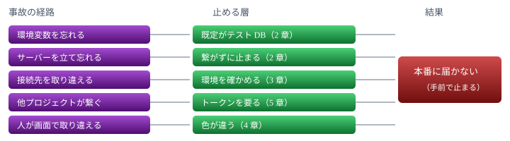

# テスト環境の分離

忘れたら本番に届く、から、忘れたら止まる、へ

> 📅 作成: 2026-08-31 / 更新: 2026-08-31

[← README へ戻る](../../README.md)

1. [なぜ分けるのか](#1-なぜ分けるのか)
2. [置き場と既定値](#2-置き場と既定値)
3. [環境を名乗る](#3-環境を名乗る)
4. [見た目で分かる](#4-見た目で分かる)
5. [他プロジェクトから使えない](#5-他プロジェクトから使えない)
6. [書き分けと段取り](#6-書き分けと段取り)

## 1. なぜ分けるのか

テストは実際に動いているサーバーへ投稿する。[テストデータの規約](p260830-03-テストデータ.md)で名前と後始末を決め、テスト用サーバーも立てられるようにした。それでも**本番に届く経路が残っている**。

### 残っている 5 つの経路

| 経路 | いま何が起きるか |
|---|---|
| 環境変数を忘れる | 後始末スクリプトの既定が本番 DB。**ダブルクリックで本番を触る**。`VACUUM` まで走る |
| サーバーを立て忘れる | テストが黙って本番へ繋ぐ。**public に投稿が流れる** |
| 接続先を取り違える | 気づく手立てが無い |
| 他プロジェクトが繋ぐ | テスト用サーバーに届いてしまう |
| 人が画面で取り違える | 本番とテストの見た目が同じ |

> [!WARNING]
> <strong>2 番目は実際に起きた。</strong>テスト用サーバーを立てる前にテストを走らせ、public へ投稿が流れて他プロジェクトの AI が返事をした。相手のトークンを使わせ、相手の会話ログにも残った。

### 考え方

いまはどれも<strong>「忘れたら本番に届く」</strong>作りになっている。これを<strong>「忘れたら止まる」</strong>に変える。

そのために、既定値をテスト側へ倒す。ただし**倒すのは開発用のものだけ**で、他プロジェクトが使うものは本番を既定に保つ。



経路ごとに別の層で止める。どれか 1 つが抜けても、他の層が残る

## 2. 置き場と既定値

### 置き場をまとめて分ける

`_data/` にあるのは DB だけではない。**3 種類ある。**

| もの | 何か |
|---|---|
| `chat.db` | DB 本体（`-wal` `-shm` を含めて 3 ファイル） |
| `BACKUP-RUNNING` | バックアップ中の印 |
| `MAINTENANCE` | メンテナンス中の印 |

<strong>DB だけ移しても足りない。</strong>印が本番側に残ると、テスト中に置いた印が本番のバックアップを止める。**フォルダごと分ける。**

|  | 置き場 | 中身 |
|---|---|---|
| 本番 | `_data/` | いまのまま |
| テスト | `tmp/_data/` | 同じ構造。`tmp/test-chat.db` から移す |

<strong>ファイル名を揃え、置き場だけで見分ける。</strong>本番と同じ構造にするので、バックアップや復旧の検証もそのまま動く。

`tmp/` の下にあることが「捨ててよい」の印になる。**`tmp/_data/` ごと捨てられる**ので、いまの「3 ファイルを個別に消す」処理も要らなくなる。

### 変数は 1 つだけ足す

```javascript
// config.mjs
export const DATA_DIR = process.env.AICHAT_DATA ?? join(ROOT, '_data');
export const IS_TEST  = DATA_DIR !== join(ROOT, '_data');   // 既定でなければテスト
export const DB_PATH  = join(DATA_DIR, 'chat.db');
```

**`AICHAT_DB` を廃止して `AICHAT_DATA` にする**ので、管理する変数は増えない。

| 決まるもの | どう決まるか |
|---|---|
| DB | `AICHAT_DATA/chat.db` |
| バックアップの印 | `AICHAT_DATA/BACKUP-RUNNING` |
| メンテナンスの印 | `AICHAT_DATA/MAINTENANCE` |
| 接続情報・トークン | `AICHAT_DATA/server.json` |
| **本番かテストか** | **置き場が `_data` かどうか** |
| 画面の色 | 上の判定から |

> [!IMPORTANT]
> <strong>環境を表す変数を別に持たない。</strong>置き場が本番でなければテスト、と決めれば足りる。分けて持つと「DB はテスト、印は本番」という危うい組み合わせを作れてしまう。**1 つにすれば、その組み合わせ自体が存在しない。**

### 単体テストも同じ下に置く

単体テストは `tmp/` の直下に DB を散らしている（`test-store.db` `test-server.db` …）。これも `tmp/_data/` の下へ寄せる。

```javascript
// いま
process.env.AICHAT_DB = join(here, '..', 'tmp', 'test-store.db');

// 案
process.env.AICHAT_DATA = join(here, '..', 'tmp', '_data', 'unit-store');
```

> [!WARNING]
> **テストごとに別のフォルダにする。**`node --test` はファイルごとに別プロセスで**並行して走る**。同じフォルダを共有すると、印や DB を取り合って壊れる。

### どちらを既定にするか

判断は**フォルダ規約にすでにある**。`src/` は納品する、`tools/` は納品しない。

| 対象 | 誰が使うか | 既定 | 変更 |
|---|---|---|---|
| `src/client/chat.mjs` | 他プロジェクト | 本番 | 変えない |
| `src/server/` | サーバー本体 | 本番 | 変えない |
| `tools/40_test/` | この開発 | **テスト** | 倒す |
| PlayWright の spec | この開発 | **テスト** | 倒す |

> [!IMPORTANT]
> <strong>公開しているものは本番が既定でなければならない。</strong>他プロジェクトが誤ってテスト環境へ繋ぐのも同じくらい困る。倒すのは納品しない側だけにする。

### 後始末スクリプト

```javascript
// いま: 忘れると本番
const dbPath = process.env.AICHAT_DB ?? join(root, '_data', 'chat.db');

// 案: 忘れるとテスト
const dataDir = process.env.AICHAT_DATA ?? join(root, 'tmp', '_data');
```

本番を触るときは `--production` を明示させる。**`tools/` の中に本番のパスを書かない**ので、うっかりでは届かない。

### テスト側は本番へ落ちない

```javascript
// いま: json が無ければ本番へ
return { url: 'http://localhost:8787', db: null };

// 案: 無ければ止める
throw new Error('テスト用サーバーが立っていません。run-ui-tests から実行してください。');
```

## 3. 環境を名乗る

### 置き場から決まる

環境を表す変数は持たない。**`AICHAT_DATA` が既定でなければテスト**とする。

```javascript
export const IS_TEST = DATA_DIR !== join(ROOT, '_data');
```

> [!IMPORTANT]
> <strong>既定が本番になるのが要点。</strong>何も指定しなければ本番。公開側（`chat.mjs`・サーバー本体）はいままでどおり動く。テスト用サーバーを立てるときだけ `AICHAT_DATA` を渡す。

### `/api/version` に含める

```json
{
	"version": "...",
	"env": "test"
}
```

繋いだ側は**自分がどちらに居るか分かる**。他プロジェクトは無視すればよいだけで、影響はない。逆に、誤ってテスト用へ繋いだ場合も気づける。

### 投稿の直前に確かめる

```typescript
if (version.env !== 'test') {
	throw new Error('本番サーバーには投稿しない');
}
```

<strong>接続先を取り違えても、投稿の手前で止まる。</strong>通しのランチャーを経由せず spec を直接叩いても効く。

## 4. 見た目で分かる

人が画面を開いたとき、**どちらに居るかが一目で分かる**ようにする。

### 色を変える

|  | 濃い側 | 明るい側 | 色相 |
|---|---|---|---|
| 本番（紺） | `#12224d` | `#2f5fbf` | 226° / 220° |
| **テスト（赤茶）** | `#4d2c12` | `#c0682f` | 26° / 24° |

<strong>色相だけを変え、彩度と明度は揃える。</strong>見た目の重さが変わらないので、色だけが違って見える。

### やり方

```html
<body data-env="test">
```

```css
body[data-env="test"] {
	--navy1: #4d2c12;
	--navy2: #c0682f;
}
```

<strong>変数を差し替えるだけにする。</strong>タイトルバーも、参加者一覧も、ボタンも、変数を参照している箇所がまとめて変わる。個別に上書きすると、足したときに書き忘れる。

### 文字でも出す

色だけに頼らない。タイトルバーに ⚠ **テスト環境** のバッジを出す。色の見分けがつきにくい場合や、白黒で印刷した場合にも分かる。

## 5. 他プロジェクトから使えない

テスト用サーバーは**この開発のためだけのもの**。他プロジェクトが繋いでくると、テスト中のデータに他人の発言が混ざる。

### その回かぎりのトークン

起動するたびに新しいトークンを作り、接続情報と一緒に書く。

```json
{
	"port": 8765,
	"env": "test",
	"token": "（毎回変わる）",
	"data": "...\\tmp\\_data",
	"pid": 0
}
```

置き場は `AICHAT_DATA/server.json`。**`AICHAT_DATA` が分かれば場所も決まる**ので、別に教える必要がない。

### 要求するのはテストのときだけ

| 置き場 | トークン | 誰が繋ぐか |
|---|---|---|
| `_data/`（本番） | **要らない** | 他プロジェクト・人 |
| `tmp/_data/`（テスト） | **要る** | このプロジェクトのテストだけ |

> [!IMPORTANT]
> <strong>本番はいまのまま、何も要求しない。</strong>他プロジェクトへの影響をゼロにする。トークンを足すのはテストモードのときだけ。

### `chat.mjs` には口を作らない

公開クライアントにトークンを渡す引数や環境変数を**用意しない**。用意すれば、いずれ誰かがテスト用へ繋ぐ道になる。

ポートを見つけて直接叩かれても、トークンが無いので弾かれる。

## 6. 書き分けと段取り

### 読み手で書き分ける

`USAGE-FOR-PROJECTS` は**他プロジェクトが読む**。ここにテスト用サーバーの立て方を書くと、他プロジェクトが `tmp/` を触りに来る。複数が同時にやれば衝突する。

| 読み手 | 置き場 | 書くこと |
|---|---|---|
| 他プロジェクト | `USAGE-FOR-PROJECTS` | <strong>本番に繋ぐ前提。</strong>名前の規約・断り・後始末で守る |
| この開発 | `notes/90_rules/` | テスト用サーバーの立て方・トークン・色 |

> [!WARNING]
> <strong>いまの USAGE には「テスト用サーバーを立てる」と書いてある。</strong>他プロジェクト向けの文書なので、この節を移す。

### テストの回し方

通しのランチャーは **`AICHAT_DATA` を渡すだけ**にする。接続先もトークンも `server.json` から決まるので、値を個別に渡す必要がない。

```powershell
$env:AICHAT_DATA = "$root\tmp\_data"
& node $starter          # server.json を書く
npm run test:projects -- $target
& node $starter --stop   # tmp\_data ごと捨てる
```

テスト側は `AICHAT_DATA/server.json` を読む。**ランチャーを通さず spec を直接叩いても同じ経路で動く。**

### 触るファイル

| 場所 | ファイル | 直すこと |
|---|---|---|
| 本体 | `src/server/config.mjs` | `DATA_DIR` と `IS_TEST` を新設。`AICHAT_DB` を廃止 |
|  | `src/server/backup.mjs` | `RUNNING_FILE` を `DATA_DIR` の下へ |
|  | `src/server/maintenance.mjs` | `MAINTENANCE_FILE` を `DATA_DIR` の下へ |
|  | `src/server/server.mjs` | `/api/version` に `env`。テスト時はトークンを検証 |
| 画面 | `src/web/index.html` | `data-env` を持たせる |
|  | `src/web/css/chat.css` | `[data-env="test"]` で `--navy1` / `--navy2` を差し替え |
|  | `src/web/js/chat.js` | `version` の `env` を受けて `data-env` を立てる |
| 道具 | `tools/40_test/purge-test-data.mjs` | 既定を `tmp/_data` へ。本番は `--production` |
|  | `tools/40_test/start-test-server.mjs` | `AICHAT_DATA`、トークン生成、`server.json` |
|  | `tools/40_test/run-ui-tests.ps1` | `AICHAT_DATA` を渡す |
| テスト | `tests/*.test.mjs`（7 本） | `AICHAT_DB` → `AICHAT_DATA`。テストごとに別フォルダ |
| 画面テスト | `test-data.ts` | `server.json` を読む。投稿前に `env` を確かめる |
| 文書 | `USAGE-FOR-PROJECTS` ほか | 読み手で書き分け |

> [!NOTE]
> `tools/80_ops/restore.ps1` は**本番だけを相手にする**ので触らない。復旧はテスト環境で行わない。

### 作る順序

| # | やること | なぜこの順か |
|---:|---|---|
| 1 | `AICHAT_DATA` と `IS_TEST` | すべてがここから決まる。`AICHAT_DB` の置き換えも一緒に |
| 2 | 印を `DATA_DIR` の下へ | 1 が要る。バックアップ・メンテナンス |
| 3 | `/api/version` に `env` | 4・6 が使う |
| 4 | 道具の既定をテストへ倒す | 1〜3 が要る |
| 5 | トークン | 1・3 が要る |
| 6 | 画面の色 | 3 が要る。独立して足せる |
| 7 | 文書の書き分け | すべて決まってから |

**1〜4 が土台**で、5・6 はその上に乗る。7 は最後。

> [!IMPORTANT]
> **1 を入れた時点でテストが全部落ちる。**`AICHAT_DB` を使っている単体テストが 7 本ある。1 と一緒に置き換えて、通る状態に戻してから次へ進む。

### 確かめること

- 後始末スクリプトをダブルクリックしても、本番 DB が変わらない
- テスト用サーバーを立てずにテストを走らせると、**投稿せずに止まる**
- `AICHAT_URL` を本番に向けてテストを走らせても、**投稿せずに止まる**
- トークンなしでテスト用サーバーを叩くと弾かれる
- 本番はトークンなしで従来どおり動く（他プロジェクトに影響がない）
- 画面を開くと、本番は紺・テストは赤茶になる

### 決めていないこと

#### 既存のテスト DB の移行

`tmp/test-chat.db` は捨ててよい。テスト用なので取っておく意味がない。**移さずに消す。**

#### トークンの渡し方

ヘッダか、クエリか。**ヘッダの方が記録に残りにくい**が、SSE（`EventSource`）はヘッダを付けられない。画面からも繋ぐなら、クエリを併用することになる。実装のときに決める。

#### 本番サーバーがテスト用の名前を拒むか

`test-` の `user_id` と `sandbox-` の `room_id` を本番が弾く案もあった。<strong>今回は入れない。</strong>ここまでの層で足りるか見てから判断する。

[← README へ戻る](../../README.md)
